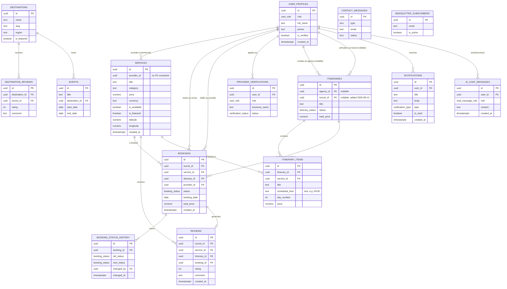

# Database Schema — Uzbekistan Digital Tourism Ecosystem

**Version:** 1.1  
**Date:** 2026-08-13  
**Database:** PostgreSQL 15 (via Supabase)  
**Extensions:** pgcrypto (confirmed — backs `gen_random_uuid()` defaults across nearly every table); PostGIS (only exercised if the `locations` table described in §3.3 actually exists in the live project — its existence has not been confirmed independently of application code)

> **Note on scope:** this document reflects the schema produced by the migrations under `supabase/migrations/` that were actually applied, not `supabase/migrations/20240101000000_init.sql`'s original table/enum definitions, which were never applied to the live project (only `agency_requests` and `services` pre-existed it). Where a table's live existence could not be independently confirmed from the migration history alone, that is called out explicitly in its section rather than asserted.

---

## Table of Contents

1. [Schema Overview](#1-schema-overview)
2. [Entity-Relationship Diagram](#2-entity-relationship-diagram)
3. [Table Definitions](#3-table-definitions)
4. [Enums & Custom Types](#4-enums--custom-types)
5. [Row-Level Security (RLS) Policies](#5-row-level-security-rls-policies)
6. [PostGIS Spatial Design](#6-postgis-spatial-design)
7. [Indexes](#7-indexes)
8. [Seed Data Examples](#8-seed-data-examples)
9. [Migration Strategy](#9-migration-strategy)

---

## 1. Schema Overview

The database is designed around a **central booking transaction model** that connects three user-facing roles (Tourist, Provider, Agency) plus Admin through a unified relational structure. There is no application-level `users` table — Supabase Auth's built-in `auth.users` is the identity table, and `public.user_profiles` extends it 1:1 (its primary key **is** the Supabase Auth user ID, not a separate generated ID with a foreign key back to it).

### Core Principle

> The `bookings` table is the **heart of the system** — it is the bridge where the shadow economy (`services`) meets formal demand (tourists and agencies, both represented as roles on `user_profiles`/`auth.users`).

### Table Summary

| Table | Purpose | Primary Relations |
|---|---|---|
| `user_profiles` | Role + profile data, one row per Supabase Auth user (`id` is both PK and FK) | → `auth.users` |
| `provider_verifications` | Admin verification workflow for providers/agencies | → `auth.users` |
| `locations` | Spatial data for Survival Maps — **live existence unconfirmed**, see §3.3 | Independent geospatial data |
| `services` | Offerings created by Local Providers | → `auth.users` (provider, **no FK constraint**) |
| `destinations` | Landing-page destination/region content | Independent |
| `destination_reviews` | Tourist reviews left directly on a destination | → `destinations`, `auth.users` |
| `events` | Festival/event listings shown on the landing page and map | → `destinations` |
| `bookings` | Central transaction table | → `auth.users` (tourist, provider), `services`, `itineraries` |
| `booking_status_history` | Audit trail for booking state changes | → `bookings` |
| `reviews` | Tourist reviews of services/itineraries, tied to a completed booking | → `auth.users`, `services`, `itineraries`, `bookings` |
| `itineraries` | Trip plans — agency-created **or** tourist self-planned | → `auth.users` (`agency_id` or `tourist_id`, both nullable) |
| `itinerary_items` | Individual items scheduled within an itinerary | → `itineraries`, `services` |
| `notifications` | In-app notification records | → `auth.users` |
| `contact_messages` | Public contact/feedback form submissions (write-only from the client) | → `auth.users` (optional) |
| `newsletter_subscribers` | Public newsletter signups | Independent |
| `ai_chat_messages` | Persistent history for the Kimi AI chat assistant | → `auth.users` |
| `agency_requests` | Legacy — superseded by `provider_verifications`, no longer written to | Independent |

Two Supabase Storage buckets exist alongside these tables — `service-photos` (public) and `menu-scans` (private) — documented in §3.18–3.19.

---

## 2. Entity-Relationship Diagram

`auth.users` (Supabase-managed, not shown as its own box below since the app never defines it) is the root identity table. `user_profiles.id` **is** `auth.users.id` — a 1:1 extension keyed on the same UUID, not a separately-generated profile ID with a foreign key back to it.



`locations` is omitted from the diagram above because its live existence is unconfirmed (see §3.3); `agency_requests` is omitted because it is a dead/orphaned table nothing in current app code writes to (see §3.17).

---

## 3. Table Definitions

### 3.1 `user_profiles`

Extended profile and role data for every Supabase Auth user — one row per user, keyed directly to `auth.users` (`id` is both the primary key and the foreign key; there is no separate `users` table in the application schema).

| Column | Type | Constraints | Description |
|---|---|---|---|
| `id` | `uuid` | PK, FK → `auth.users(id)` ON DELETE CASCADE | Matches the Supabase Auth user ID |
| `role` | `user_role` | NOT NULL, DEFAULT `'tourist'` | Enum: `tourist`, `provider`, `agency`, `admin` |
| `full_name` | `text` | | Display name |
| `phone` | `text` | | Phone number |
| `avatar_url` | `text` | | Profile photo URL — no upload UI exists yet in the tourist app; this is a static placeholder in practice |
| `is_verified` | `boolean` | NOT NULL, DEFAULT `false` | Admin verification status (providers/agencies); back-filled `true` for pre-existing `tourist`/`admin` rows when this column was introduced |
| `created_at` | `timestamptz` | NOT NULL, DEFAULT `NOW()` | |
| `updated_at` | `timestamptz` | NOT NULL, DEFAULT `NOW()` | No trigger bumps this on UPDATE — application code must set it manually |

There is no `metadata` JSONB column and no `bio`/`language`/`country` columns. Role-specific data (business name, license number, etc.) lives on `provider_verifications` instead, not on `user_profiles`.

A trigger, `on_auth_user_created` (`AFTER INSERT ON auth.users` → `public.handle_new_user()`, `SECURITY DEFINER`), auto-inserts a `user_profiles` row from `raw_user_meta_data->>'full_name'`/`raw_user_meta_data->>'role'` (defaulting to `'tourist'`) on signup, `ON CONFLICT (id) DO NOTHING`.

### 3.2 `provider_verifications`

Admin workflow for verifying new providers and agencies before they can list on the platform.

| Column | Type | Constraints | Description |
|---|---|---|---|
| `id` | `uuid` | PK, DEFAULT `gen_random_uuid()` | Verification request ID |
| `user_id` | `uuid` | FK → `auth.users(id)` ON DELETE CASCADE, UNIQUE | Applicant |
| `role` | `user_role` | NOT NULL, CHECK `role IN ('provider','agency')` | Role being requested |
| `business_name` | `text` | NOT NULL | |
| `email` | `text` | NOT NULL | |
| `phone` | `text` | | |
| `status` | `verification_status` | NOT NULL, DEFAULT `'pending'` | Enum: `pending`, `approved`, `rejected` |
| `documents_url` | `text` | | Uploaded verification documents |
| `metadata` | `jsonb` | NOT NULL, DEFAULT `'{}'` | Also carries the rejection reason (as a key inside this JSON) when `status = 'rejected'` — there is no separate `rejection_reason` column |
| `created_at` | `timestamptz` | NOT NULL, DEFAULT `NOW()` | |
| `updated_at` | `timestamptz` | NOT NULL, DEFAULT `NOW()` | |

There is no `admin_id` or `reviewed_at` column. This table is added to the `supabase_realtime` publication so `/auth/pending` can unblock a waiting user instantly on approval.

### 3.3 `locations`

Spatial data intended for the Survival Map (SOS hubs, toilets, pharmacies, etc.).

> **Live existence unconfirmed.** No file under `supabase/migrations/` that actually ran creates `public.locations`, the `location_category` enum, or the `get_locations_in_radius()` RPC — yet application code (`packages/database/src/types.ts`'s `Location`/`LocationCategory`, `packages/database/src/client.ts`'s `fetchLocationsInRadius`) references all three as if they exist. The table's baseline `service-photos`/`agency_requests` era predates the applied-migrations trail, so this may have been created directly against the live project outside `supabase/migrations/`, or it may not exist at all. The shape below is what the application code assumes, sourced from `packages/database/schema/02_locations.sql`; treat it as **unverified against the live database** until confirmed directly.

| Column | Type | Constraints | Description |
|---|---|---|---|
| `id` | `uuid` | PK | Location ID |
| `name` | `text` | NOT NULL | Location name |
| `description` | `text` | | |
| `category` | `location_category` | NOT NULL | Enum — see §4; exact live value set is also unconfirmed |
| `coordinates` | `geography(Point, 4326)` | NOT NULL | PostGIS point |
| `created_at` | `timestamptz` | | |
| `updated_at` | `timestamptz` | | |

There are no `name_uz`/`name_ru`/`address`/`city`/`region`/`phone`/`operating_hours`/`metadata`/`is_active`/`verified_by` columns in the source this was derived from — those were part of an earlier, unapplied design and should not be assumed present.

### 3.4 `services`

Offerings created by Local Providers (yurt stays, masterclasses, camel rides, etc.) — the shadow-economy inventory the platform surfaces to tourists. Built additively across five migrations on top of the original `packages/database/schema/03_services.sql`.

| Column | Type | Constraints | Description |
|---|---|---|---|
| `id` | `uuid` | PK, DEFAULT `gen_random_uuid()` | |
| `provider_id` | `uuid` | NULLABLE, **no FK constraint** | Provider who created this service — plain `uuid`, not `REFERENCES user_profiles`/`auth.users` |
| `title` | `text` | NOT NULL | |
| `description` | `text` | | |
| `category` | `text` | NOT NULL | Free-text category, not an enum |
| `price` | `numeric` | NOT NULL, DEFAULT `0` | |
| `currency` | `text` | NOT NULL, DEFAULT `'UZS'` | |
| `image_url` | `text` | | |
| `avg_rating` | `numeric(3,2)` | DEFAULT `0.0` | Legacy rating column — still the one indexed, and still what provider-app/agency-portal read |
| `reviews_count` | `integer` | DEFAULT `0` | Legacy — paired with `avg_rating` |
| `created_at` | `timestamptz` | NOT NULL, DEFAULT `timezone('utc', now())` | |
| `updated_at` | `timestamptz` | NOT NULL, DEFAULT `timezone('utc', now())` | |
| `location` | `text` | | Free-text location label — **not** a PostGIS column |
| `is_rural_provider` | `boolean` | DEFAULT `false` | |
| `provider_name` | `text` | | |
| `duration_display` | `text` | | |
| `is_featured` | `boolean` | DEFAULT `false` | |
| `is_available` | `boolean` | NOT NULL, DEFAULT `true` | Provider's online/offline toggle — column exists but no UI in `provider-app` currently reads or writes it (F-P01 not yet built) |
| `rating_avg` | `numeric(2,1)` | NOT NULL, DEFAULT `0.0` | Newer rating column, backfilled once from `avg_rating` at migration time; **not kept in sync going forward** — the two rating pairs can now diverge |
| `rating_count` | `integer` | NOT NULL, DEFAULT `0` | Newer — paired with `rating_avg`, same one-time-backfill caveat |
| `duration_minutes` | `integer` | | |
| `max_guests` | `integer` | | |
| `city` | `text` | | |
| `region` | `text` | | |
| `latitude` | `numeric` | | Plain numeric column, not PostGIS |
| `longitude` | `numeric` | | Plain numeric column, not PostGIS |

There is no `geography(Point, 4326)` column on this table (see §6), no `title_uz`/`title_ru`/`description_uz`/`description_ru`, and no `address` column.

### 3.5 `destinations`

Landing-page destination/region content (hero cards shown on the marketing site and map).

| Column | Type | Constraints | Description |
|---|---|---|---|
| `id` | `uuid` | PK, DEFAULT `gen_random_uuid()` | |
| `name` | `text` | NOT NULL | |
| `slug` | `text` | NOT NULL, UNIQUE | |
| `description` | `text` | | |
| `region` | `text` | | |
| `image_url` | `text` | | |
| `hero_image_url` | `text` | | |
| `latitude` | `double precision` | | |
| `longitude` | `double precision` | | |
| `service_count` | `integer` | DEFAULT `0` | |
| `is_featured` | `boolean` | DEFAULT `false` | |
| `display_order` | `integer` | DEFAULT `0` | |
| `created_at` | `timestamptz` | NOT NULL, DEFAULT `NOW()` | |
| `updated_at` | `timestamptz` | NOT NULL, DEFAULT `NOW()` | |
| `body` | `text` | | Long-form destination copy |
| `gallery_images` | `text[]` | NOT NULL, DEFAULT `'{}'` | |

### 3.6 `destination_reviews`

Tourist reviews left directly on a destination (distinct from `reviews`, which is scoped to a service/itinerary and requires a completed booking).

| Column | Type | Constraints | Description |
|---|---|---|---|
| `id` | `uuid` | PK, DEFAULT `gen_random_uuid()` | |
| `destination_id` | `uuid` | NOT NULL, FK → `destinations(id)` ON DELETE CASCADE | |
| `tourist_id` | `uuid` | NOT NULL, FK → `auth.users(id)` | |
| `rating` | `int` | NULLABLE, CHECK `rating BETWEEN 1 AND 5` | Nullable, unlike `reviews.rating` |
| `comment` | `text` | NOT NULL | |
| `created_at` | `timestamptz` | DEFAULT `now()` | |

### 3.7 `events`

Festival/event listings shown on the landing page and map.

| Column | Type | Constraints | Description |
|---|---|---|---|
| `id` | `uuid` | PK, DEFAULT `gen_random_uuid()` | |
| `title` | `text` | NOT NULL | |
| `description` | `text` | | |
| `location` | `text` | | Free-text label |
| `destination_id` | `uuid` | NULLABLE, FK → `destinations(id)` | |
| `image_url` | `text` | | |
| `start_date` | `date` | NOT NULL | |
| `end_date` | `date` | | |
| `event_type` | `text` | DEFAULT `'festival'` | |
| `is_featured` | `boolean` | DEFAULT `false` | |
| `ticket_url` | `text` | | |
| `latitude` | `numeric` | | |
| `longitude` | `numeric` | | |
| `slug` | `text` | UNIQUE, NULLABLE | Nullable by design — not yet backfilled or tightened to NOT NULL |

### 3.8 `itineraries`

Trip plans — **either** agency-created **or** tourist self-planned. Originally agency-only; tourist self-planning was added on 2026-08-12 for the AI itinerary generator.

| Column | Type | Constraints | Description |
|---|---|---|---|
| `id` | `uuid` | PK, DEFAULT `gen_random_uuid()` | Itinerary ID |
| `agency_id` | `uuid` | NULLABLE, FK → `auth.users(id)` | Creating agency — **always nullable**, never `NOT NULL` |
| `tourist_id` | `uuid` | NULLABLE, FK → `auth.users(id)` ON DELETE CASCADE | **Added 2026-08-12.** The self-planning tourist owner. Mutually exclusive with `agency_id` by convention only — there is no DB-level `CHECK` constraint enforcing that exactly one of the two is set |
| `title` | `text` | NOT NULL | Trip name |
| `description` | `text` | | Trip overview |
| `start_date` | `date` | | |
| `end_date` | `date` | | |
| `status` | `itinerary_status` | DEFAULT `'draft'` | Enum: `draft`, `active`, `completed` |
| `total_price` | `numeric(12,2)` | DEFAULT `0` | |
| `currency` | `text` | DEFAULT `'UZS'` | AI-generated self-planned itineraries are saved with `currency: 'USD'` by the `saveGeneratedItinerary` server action, hardcoded, regardless of this column's default — a data-consistency point worth watching |
| `created_at` | `timestamptz` | DEFAULT `now()` | |
| `updated_at` | `timestamptz` | DEFAULT `now()` | |

`tourist_id` on this table does **not** mean "agency-assigned client" — it means the tourist is the itinerary's own author/owner, planning solo (typically via the AI itinerary generator).

### 3.9 `itinerary_items`

Individual items scheduled within an itinerary. Originally just linked services with a price/sort order; gained four nullable columns on 2026-08-12 to support AI-generated, non-catalog activities.

| Column | Type | Constraints | Description |
|---|---|---|---|
| `id` | `uuid` | PK, DEFAULT `gen_random_uuid()` | |
| `itinerary_id` | `uuid` | NULLABLE, FK → `itineraries(id)` ON DELETE CASCADE | |
| `service_id` | `uuid` | NULLABLE, FK → `services(id)` | Linked catalog service (nullable for AI-generated/custom items) |
| `title` | `text` | | Item label |
| `price` | `numeric(12,2)` | | Item cost |
| `sort_order` | `int` | DEFAULT `0` | |
| `created_at` | `timestamptz` | DEFAULT `now()` | |
| `description` | `text` | **Added 2026-08-12** | Populated for AI-generated activities |
| `location_name` | `text` | **Added 2026-08-12** | |
| `scheduled_time` | `text` | **Added 2026-08-12** | Plain text (e.g. `"09:00"`) — **not** a `time`/`timestamptz` column |
| `day_number` | `int` | **Added 2026-08-12** | |

There is no `scheduled_date`, `start_time` (as a `time` column), `duration_minutes`, or `notes` column on this table.

### 3.10 `bookings`

The central transaction table connecting tourists, services/itineraries, and providers.

| Column | Type | Constraints | Description |
|---|---|---|---|
| `id` | `uuid` | PK, DEFAULT `gen_random_uuid()` | Booking ID |
| `tourist_id` | `uuid` | NOT NULL, FK → `auth.users(id)` | The tourist making the booking |
| `service_id` | `uuid` | NULLABLE, FK → `services(id)` | The booked service |
| `itinerary_id` | `uuid` | NULLABLE, FK → `itineraries(id)` | The booked itinerary (package) |
| `provider_id` | `uuid` | NULLABLE, FK → `auth.users(id)` | The provider/agency owning this booking |
| `status` | `booking_status` | DEFAULT `'pending'` | Current booking state |
| `booking_date` | `date` | NOT NULL | Date of the experience |
| `guest_count` | `int` | DEFAULT `1` | Number of guests |
| `special_requests` | `text` | | |
| `passenger_manifest` | `jsonb` | | |
| `dietary_preferences` | `text` | | |
| `pickup_location` | `text` | | |
| `total_price` | `numeric(12,2)` | | |
| `currency` | `text` | DEFAULT `'UZS'` | |
| `created_at` | `timestamptz` | DEFAULT `now()` | |
| `updated_at` | `timestamptz` | DEFAULT `now()` | |

**Constraint:** `CHECK (num_nonnulls(service_id, itinerary_id) = 1)` — exactly one of `service_id`/`itinerary_id` must be set. There is no `agency_id` column on this table — the agency's relationship to a booking runs through `itinerary_id → itineraries.agency_id`, and `provider_id` (not `agency_id`) is what a provider/agency row actually filters on.

### 3.11 `booking_status_history`

Audit trail for all booking state transitions.

| Column | Type | Constraints | Description |
|---|---|---|---|
| `id` | `uuid` | PK, DEFAULT `gen_random_uuid()` | |
| `booking_id` | `uuid` | NULLABLE, FK → `bookings(id)` ON DELETE CASCADE | |
| `old_status` | `booking_status` | | |
| `new_status` | `booking_status` | NOT NULL | |
| `changed_by` | `uuid` | NULLABLE, FK → `auth.users(id)` | |
| `notes` | `text` | | |
| `changed_at` | `timestamptz` | DEFAULT `now()` | |

### 3.12 `reviews`

Tourist reviews of services/itineraries, tied to a completed booking.

| Column | Type | Constraints | Description |
|---|---|---|---|
| `id` | `uuid` | PK, DEFAULT `gen_random_uuid()` | |
| `tourist_id` | `uuid` | NOT NULL, FK → `auth.users(id)` | Reviewing tourist |
| `service_id` | `uuid` | NULLABLE, FK → `services(id)` | |
| `itinerary_id` | `uuid` | NULLABLE, FK → `itineraries(id)` | |
| `booking_id` | `uuid` | NOT NULL, FK → `bookings(id)`, UNIQUE | One review per booking |
| `rating` | `int` | NOT NULL, CHECK `rating BETWEEN 1 AND 5` | |
| `comment` | `text` | | |
| `response` | `text` | | Business reply |
| `response_at` | `timestamptz` | | |
| `created_at` | `timestamptz` | DEFAULT `now()` | |

### 3.13 `notifications`

In-app notification records for all user types.

| Column | Type | Constraints | Description |
|---|---|---|---|
| `id` | `uuid` | PK, DEFAULT `gen_random_uuid()` | |
| `user_id` | `uuid` | NOT NULL, FK → `auth.users(id)` | Recipient |
| `title` | `text` | NOT NULL | |
| `body` | `text` | NOT NULL | |
| `type` | `notification_type` | NOT NULL | Enum: see §4 |
| `action_url` | `text` | | |
| `is_read` | `bool` | DEFAULT `false` | |
| `created_at` | `timestamptz` | DEFAULT `now()` | |

These are in-app records, not push notifications — no `PushManager`/web-push integration exists anywhere in the codebase.

### 3.14 `contact_messages`

Public contact/feedback form submissions. Write-only from the public API — there is no public SELECT policy; only the admin-portal (via the service-role key) can read these.

| Column | Type | Constraints | Description |
|---|---|---|---|
| `id` | `uuid` | PK, DEFAULT `gen_random_uuid()` | |
| `type` | `text` | NOT NULL, DEFAULT `'contact'`, CHECK `type IN ('contact','feedback')` | |
| `name` | `text` | NOT NULL | |
| `email` | `text` | NOT NULL | |
| `subject` | `text` | | |
| `message` | `text` | NOT NULL | |
| `rating` | `int` | CHECK `rating BETWEEN 1 AND 5` | |
| `page_source` | `text` | | |
| `user_id` | `uuid` | NULLABLE, FK → `auth.users(id)` | |
| `status` | `text` | NOT NULL, DEFAULT `'new'`, CHECK `status IN ('new','read','resolved')` | |
| `created_at` | `timestamptz` | DEFAULT `now()` | |

### 3.15 `newsletter_subscribers`

Public newsletter signups from the site footer. Same write-only-via-public-API model as `contact_messages`.

| Column | Type | Constraints | Description |
|---|---|---|---|
| `id` | `uuid` | PK, DEFAULT `gen_random_uuid()` | |
| `email` | `text` | NOT NULL, UNIQUE | |
| `is_active` | `boolean` | NOT NULL, DEFAULT `true` | |
| `source` | `text` | | e.g. `"footer"` |
| `created_at` | `timestamptz` | DEFAULT `now()` | |
| `updated_at` | `timestamptz` | DEFAULT `now()` | |

There is no UPDATE policy — the admin-portal's pause/resume toggle on a subscriber goes through the service-role key, not RLS.

### 3.16 `ai_chat_messages`

Persistent per-user history for the Kimi-powered AI chat assistant reachable from the global Sparkles FAB (`/ai-chat`), which replaced the earlier separate AI-assistant and translator circles.

| Column | Type | Constraints | Description |
|---|---|---|---|
| `id` | `uuid` | PK, DEFAULT `gen_random_uuid()` | |
| `user_id` | `uuid` | NOT NULL, FK → `auth.users(id)` ON DELETE CASCADE | |
| `role` | `chat_message_role` | NOT NULL | Enum: `'user'` \| `'assistant'` |
| `content` | `text` | NOT NULL | |
| `created_at` | `timestamptz` | NOT NULL, DEFAULT `now()` | |

Anonymous users can chat too, but only signed-in users get messages persisted here — anonymous conversation context is carried client-side (`history` in the request body, capped to the last 20 turns) and never written to this table.

### 3.17 `agency_requests` (legacy, orphaned)

The original agency sign-up table, superseded by `provider_verifications`. Left in place (not dropped) but nothing in current app code writes to it going forward.

| Column | Type | Constraints | Description |
|---|---|---|---|
| `id` | `uuid` | PK | |
| `company_name` | `text` | NOT NULL | |
| `email` | `text` | NOT NULL, UNIQUE | |
| `phone` | `text` | | |
| `status` | `varchar(50)` | NOT NULL, DEFAULT `'pending'` | |
| `metadata` | `jsonb` | DEFAULT `'{}'` | |
| `created_at` | `timestamptz` | | |
| `updated_at` | `timestamptz` | | |

### 3.18 Storage bucket: `service-photos`

Public bucket for provider service photos, uploaded from the provider-app/agency-portal listing forms.

| Setting | Value |
|---|---|
| `public` | `true` |
| `file_size_limit` | none set |
| `allowed_mime_types` | none set (any type accepted) |

RLS (on `storage.objects`): owners can INSERT/UPDATE/DELETE objects whose path's first folder segment matches `auth.uid()::text` (`(storage.foldername(name))[1] = auth.uid()::text`); anyone can SELECT (`bucket_id = 'service-photos'`).

### 3.19 Storage bucket: `menu-scans`

Private bucket storing photos submitted to the Taste & Trust menu scanner (`POST /api/v1/ai/scan-menu`), scoped per user.

| Setting | Value |
|---|---|
| `public` | `false` |
| `file_size_limit` | `10485760` (10 MB) |
| `allowed_mime_types` | `['image/jpeg', 'image/png']` |

Upload path convention: `<user_id>/<uuid>.<ext>` where `ext` is `png` or `jpg`. The upload is **best-effort and non-blocking** — if it fails, the scan request still succeeds and the failure is only logged.

RLS (on `storage.objects`, all policies scoped `TO authenticated`): INSERT, SELECT, and DELETE are each allowed only where `bucket_id = 'menu-scans' AND (storage.foldername(name))[1] = auth.uid()::text`. There is no UPDATE policy.

---

## 4. Enums & Custom Types

```sql
-- User roles
CREATE TYPE user_role AS ENUM ('tourist', 'provider', 'agency', 'admin');

-- Verification status (provider_verifications.status)
CREATE TYPE verification_status AS ENUM ('pending', 'approved', 'rejected');

-- Booking status workflow
CREATE TYPE booking_status AS ENUM (
  'pending',          -- Tourist submitted, waiting for provider
  'accepted',         -- Provider accepted
  'declined',         -- Provider declined
  'completed',        -- Experience finished
  'cancelled'         -- Cancelled by tourist or agency
);

-- Itinerary status
CREATE TYPE itinerary_status AS ENUM (
  'draft',       -- Being built (agency-created or tourist self-planned)
  'active',      -- Trip is in progress
  'completed'    -- Trip finished
);

-- Notification types
CREATE TYPE notification_type AS ENUM (
  'booking_request',       -- New booking for provider
  'booking_accepted',      -- Provider accepted booking
  'booking_declined',      -- Provider declined booking
  'review_received',       -- Tourist left a review
  'system'                 -- System announcements
);

-- AI chat message role — new, backs ai_chat_messages.role
CREATE TYPE chat_message_role AS ENUM ('user', 'assistant');

-- Location category for the Survival Map — existence of this type in the live
-- database is unconfirmed (see §3.3). Two conflicting value sets exist across
-- unapplied source files: one with 'food'/'stay' included, one without.
CREATE TYPE location_category AS ENUM (
  'sos', 'toilet', 'cultural', 'festival', 'pharmacy', 'atm', 'wifi', 'water'
  -- possibly also 'food', 'stay' — unconfirmed which set (if either) is live
);
```

Payment status was scoped out (no payments in Stage 2). There is no `location_type`, `media_type`, `stamp_type`, or `service_category` enum in the live schema — `services.category` is plain `TEXT`, and the `service_media`/`impact_stamps` tables these other enums would have backed do not exist as deployed tables (see §3 for what does exist).

`packages/database/src/types.ts`'s generated `Database.public.Enums` map only lists `location_category`, `user_role`, and `verification_status` — `booking_status`, `itinerary_status`, `notification_type`, and `chat_message_role` are absent from that map (they're typed via `@repo/types` string unions instead), which is a type-generation gap worth knowing about but not itself a runtime bug.

---

## 5. Row-Level Security (RLS) Policies

All tables below have RLS **enabled**. There is no `EXISTS (SELECT 1 FROM users WHERE id = auth.uid() AND role = 'admin')`-style admin bypass policy on any table — the admin-portal instead uses the Supabase **service-role key** in its Server Actions, which bypasses RLS entirely rather than being granted through a policy. Several policies below are also `TO authenticated`-scoped explicitly, unlike most of the schema's policies, which are role-unrestricted (implicitly `TO public`).

### 5.1 `user_profiles` Policies

```sql
CREATE POLICY "Users can view own profile"
  ON user_profiles FOR SELECT
  USING (auth.uid() = id);

CREATE POLICY "Users can update own profile"
  ON user_profiles FOR UPDATE
  USING (auth.uid() = id);

-- Fully public read — overlaps/widens the policy above; permissive
-- policies are OR'd together, so this alone makes every profile world-readable
CREATE POLICY "Profiles are readable by everyone"
  ON user_profiles FOR SELECT
  USING (true);
```

### 5.2 `provider_verifications` Policies

```sql
CREATE POLICY "Users can view their own verification request"
  ON provider_verifications FOR SELECT
  USING (auth.uid() = user_id);

CREATE POLICY "Users can insert their own verification request"
  ON provider_verifications FOR INSERT
  WITH CHECK (auth.uid() = user_id);

CREATE POLICY "Admins can select all verification requests"
  ON provider_verifications FOR SELECT
  USING (
    COALESCE(auth.jwt()->'app_metadata'->>'role', auth.jwt()->'user_metadata'->>'role') = 'admin'
  );

CREATE POLICY "Admins can update all verification requests"
  ON provider_verifications FOR UPDATE
  USING (
    COALESCE(auth.jwt()->'app_metadata'->>'role', auth.jwt()->'user_metadata'->>'role') = 'admin'
  );
```

### 5.3 `services` Policies

```sql
-- Every service row is publicly readable — no is_available filter
CREATE POLICY "Services are publicly readable"
  ON services FOR SELECT
  USING (true);

CREATE POLICY "Owners can insert their own services"
  ON services FOR INSERT
  WITH CHECK (auth.uid() = provider_id);

CREATE POLICY "Owners can update their own services"
  ON services FOR UPDATE
  USING (auth.uid() = provider_id);

CREATE POLICY "Owners can delete their own services"
  ON services FOR DELETE
  USING (auth.uid() = provider_id);
```

### 5.4 `destinations`, `destination_reviews`, `events` Policies

```sql
-- destinations: public read only — no INSERT/UPDATE/DELETE policy exists,
-- writes go through the admin-portal's service-role client
CREATE POLICY "Destinations are publicly readable"
  ON destinations FOR SELECT
  USING (true);

-- destination_reviews
CREATE POLICY "Destination reviews are publicly readable"
  ON destination_reviews FOR SELECT
  USING (true);

CREATE POLICY "Tourists can write their own destination reviews"
  ON destination_reviews FOR INSERT
  WITH CHECK (tourist_id = auth.uid());
-- no UPDATE/DELETE policy

-- events: public read only, same as destinations — no write policy for
-- anyone but the service-role client
CREATE POLICY "Events are publicly readable"
  ON events FOR SELECT
  USING (true);
```

### 5.5 `itineraries` and `itinerary_items` Policies

```sql
-- itineraries
CREATE POLICY "Owners can read/write their own itineraries"
  ON itineraries FOR ALL
  USING (agency_id = auth.uid());

CREATE POLICY "Tourists can read/write their own self-planned itineraries"
  ON itineraries FOR ALL
  USING (tourist_id = auth.uid());

-- itinerary_items
CREATE POLICY "Owners can read/write their own itinerary items"
  ON itinerary_items FOR ALL
  USING (itinerary_id IN (SELECT id FROM itineraries WHERE agency_id = auth.uid()));

CREATE POLICY "Tourists can read/write items on their own self-planned itineraries"
  ON itinerary_items FOR ALL
  USING (itinerary_id IN (SELECT id FROM itineraries WHERE tourist_id = auth.uid()));
```

Both `FOR ALL` policies above omit an explicit `WITH CHECK` clause — Postgres reuses the `USING` expression for `WITH CHECK` in that case, so this is not a gap, just worth knowing when reading the migration directly.

### 5.6 `bookings` and `booking_status_history` Policies

```sql
-- bookings
CREATE POLICY "Tourists can read/write their own bookings"
  ON bookings FOR ALL
  USING (tourist_id = auth.uid());

CREATE POLICY "Providers/Agencies can read/write their own bookings"
  ON bookings FOR ALL
  USING (provider_id = auth.uid());

-- booking_status_history
CREATE POLICY "Tourists can read/write their own booking history"
  ON booking_status_history FOR ALL
  USING (booking_id IN (SELECT id FROM bookings WHERE tourist_id = auth.uid()));

CREATE POLICY "Providers/Agencies can read/write their own booking history"
  ON booking_status_history FOR ALL
  USING (booking_id IN (SELECT id FROM bookings WHERE provider_id = auth.uid()));
```

There is no `agency_id`-scoped policy on `bookings` — the column doesn't exist on this table (see §3.10). `bookings` and `notifications` are also added to the `supabase_realtime` publication so provider-app/agency-portal can subscribe to live updates.

### 5.7 `reviews` Policies

```sql
CREATE POLICY "Tourists can read/write their own reviews"
  ON reviews FOR ALL
  USING (tourist_id = auth.uid());

CREATE POLICY "Providers/Agencies can read/write reviews for their bookings"
  ON reviews FOR ALL
  USING (booking_id IN (SELECT id FROM bookings WHERE provider_id = auth.uid()));

-- Added later to fix SSR pages showing empty review lists
CREATE POLICY "Reviews are publicly readable"
  ON reviews FOR SELECT
  USING (true);
```

### 5.8 `notifications` Policies

```sql
CREATE POLICY "Users can read/write their own notifications"
  ON notifications FOR ALL
  USING (user_id = auth.uid());

-- Opens INSERT cross-user so e.g. a provider can notify a tourist on
-- booking accept/decline. SELECT/UPDATE/DELETE remain self-scoped.
CREATE POLICY "Authenticated users can create notifications for others"
  ON notifications FOR INSERT
  WITH CHECK (auth.role() = 'authenticated');
```

### 5.9 `contact_messages` and `newsletter_subscribers` Policies

```sql
-- contact_messages: insert-only, no SELECT policy at all — readable only
-- via the admin-portal's service-role client
CREATE POLICY "Anyone can submit a contact or feedback message"
  ON contact_messages FOR INSERT
  WITH CHECK (true);

-- newsletter_subscribers: same insert-only pattern, no UPDATE policy
CREATE POLICY "Anyone can subscribe to the newsletter"
  ON newsletter_subscribers FOR INSERT
  WITH CHECK (true);
```

### 5.10 `ai_chat_messages` Policies

```sql
CREATE POLICY "Users can view their own chat history"
  ON ai_chat_messages FOR SELECT
  TO authenticated
  USING (auth.uid() = user_id);

CREATE POLICY "Users can insert their own chat messages"
  ON ai_chat_messages FOR INSERT
  TO authenticated
  WITH CHECK (auth.uid() = user_id);
```

No UPDATE/DELETE policy exists — chat messages are immutable and undeletable via the public API once written.

### 5.11 `locations` Policies

> Same live-existence caveat as §3.3 applies here.

```sql
CREATE POLICY "Public can read locations"
  ON locations FOR SELECT
  USING (true);
```

No admin-only management policy or `is_active` column is confirmed to exist for this table in the sources it was derived from.

---

## 6. PostGIS Spatial Design

### 6.1 Spatial Columns

| Table | Column | Type | SRID | Usage |
|---|---|---|---|---|
| `services` | `location` | `geography(Point, 4326)` | WGS 84 | Provider service geolocation |
| `locations` | `coordinates` | `geography(Point, 4326)` | WGS 84 | Map pins (SOS, toilets, sites) |

### 6.2 Common Spatial Queries

**Find services within N km of a point:**
```sql
SELECT id, title, price,
  ST_Distance(location, ST_MakePoint(66.9597, 39.6542)::geography) AS distance_m
FROM services
WHERE is_available = true
  AND ST_DWithin(location, ST_MakePoint(66.9597, 39.6542)::geography, 50000) -- 50km radius
ORDER BY distance_m;
```

**Find nearest SOS hub to a tourist's position:**
```sql
SELECT id, name, phone,
  ST_Distance(coordinates, ST_MakePoint(:lng, :lat)::geography) AS distance_m
FROM locations
WHERE type = 'sos_hub' AND is_active = true
ORDER BY coordinates <-> ST_MakePoint(:lng, :lat)::geography
LIMIT 5;
```

**Generate heatmap data (tourist clustering):**
```sql
SELECT
  ST_SnapToGrid(
    ST_Transform(coordinates::geometry, 3857), 500 -- 500m grid cells
  ) AS grid_cell,
  COUNT(*) AS density
FROM analytics_events
WHERE event_name = 'location_ping'
  AND created_at > NOW() - INTERVAL '1 hour'
GROUP BY grid_cell
ORDER BY density DESC;
```

### 6.3 Spatial Indexes

```sql
CREATE INDEX idx_services_location ON services USING GIST (location);
CREATE INDEX idx_locations_coordinates ON locations USING GIST (coordinates);
```

---

## 7. Indexes

### 7.1 Primary Indexes (Auto-created)

All primary key columns (`id`) automatically have unique B-tree indexes.

### 7.2 Foreign Key Indexes

```sql
-- users
CREATE INDEX idx_users_role ON users (role);
CREATE INDEX idx_users_email ON users (email);

-- user_profiles
CREATE INDEX idx_user_profiles_user_id ON user_profiles (user_id);

-- services
CREATE INDEX idx_services_provider_id ON services (provider_id);
CREATE INDEX idx_services_category ON services (category);
CREATE INDEX idx_services_is_available ON services (is_available);
CREATE INDEX idx_services_city ON services (city);

-- bookings
CREATE INDEX idx_bookings_tourist_id ON bookings (tourist_id);
CREATE INDEX idx_bookings_service_id ON bookings (service_id);
CREATE INDEX idx_bookings_agency_id ON bookings (agency_id);
CREATE INDEX idx_bookings_status ON bookings (status);
CREATE INDEX idx_bookings_date ON bookings (booking_date);

-- reviews
CREATE INDEX idx_reviews_service_id ON reviews (service_id);
CREATE INDEX idx_reviews_tourist_id ON reviews (tourist_id);

-- itineraries
CREATE INDEX idx_itineraries_agency_id ON itineraries (agency_id);
CREATE INDEX idx_itineraries_tourist_id ON itineraries (tourist_id);

-- notifications
CREATE INDEX idx_notifications_user_id ON notifications (user_id);
CREATE INDEX idx_notifications_is_read ON notifications (is_read);

-- analytics
CREATE INDEX idx_analytics_event_name ON analytics_events (event_name);
CREATE INDEX idx_analytics_created_at ON analytics_events (created_at);
CREATE INDEX idx_analytics_user_id ON analytics_events (user_id);
```

---

## 8. Seed Data Examples

### 8.1 Sample Users

```sql
INSERT INTO users (id, email, role, is_active, is_verified) VALUES
  ('a1b2c3d4-0001-4000-8000-000000000001', 'tourist@example.com', 'tourist', true, true),
  ('a1b2c3d4-0002-4000-8000-000000000002', 'rustam@provider.uz', 'provider', true, true),
  ('a1b2c3d4-0003-4000-8000-000000000003', 'silkroad@agency.uz', 'agency', true, true),
  ('a1b2c3d4-0004-4000-8000-000000000004', 'admin@platform.uz', 'admin', true, true);
```

### 8.2 Sample Services

```sql
INSERT INTO services (id, provider_id, title, description, category, price, currency, duration_minutes, max_guests, is_available, location, city, region)
VALUES
  (
    gen_random_uuid(),
    'a1b2c3d4-0002-4000-8000-000000000002',
    'Traditional Tandir Bread Baking Masterclass',
    'Learn to bake traditional Uzbek bread in a clay tandir oven with master baker Rustam. Includes hands-on experience, tea, and fresh bread to take home.',
    'masterclass',
    150000.00,
    'UZS',
    120,
    8,
    true,
    ST_MakePoint(66.9597, 39.6542)::geography, -- Samarkand
    'Samarkand',
    'Samarkand Region'
  ),
  (
    gen_random_uuid(),
    'a1b2c3d4-0002-4000-8000-000000000002',
    'Desert Camel Riding Experience',
    'A 2-hour camel ride through the Kyzylkum Desert with a local Bedouin guide. Includes traditional tea ceremony at a desert camp.',
    'adventure',
    300000.00,
    'UZS',
    120,
    6,
    true,
    ST_MakePoint(62.8578, 41.5513)::geography, -- Nurata
    'Nurata',
    'Navoi Region'
  );
```

### 8.3 Sample Locations (Survival Map)

```sql
INSERT INTO locations (id, name, description, type, coordinates, city, region, is_active)
VALUES
  (gen_random_uuid(), 'Tourist Police HQ - Samarkand', 'Main tourist police station. English-speaking officers available 24/7.', 'sos_hub', ST_MakePoint(66.9597, 39.6542)::geography, 'Samarkand', 'Samarkand Region', true),
  (gen_random_uuid(), 'Registan Square Public Toilet', 'Clean, maintained public restroom near Registan Square entrance.', 'clean_toilet', ST_MakePoint(66.9756, 39.6548)::geography, 'Samarkand', 'Samarkand Region', true),
  (gen_random_uuid(), 'Bibi-Khanym Mosque', 'Historic 15th-century mosque. Dress code required: knees and shoulders covered.', 'cultural_site', ST_MakePoint(66.9787, 39.6601)::geography, 'Samarkand', 'Samarkand Region', true);
```

---

## 9. Migration Strategy

### 9.1 Tooling

All migrations are managed via **Supabase CLI** and stored in the `supabase/migrations/` directory within the monorepo.

### 9.2 Migration Workflow

```bash
# Create a new migration
pnpm supabase migration new create_users_table

# Apply migrations locally
pnpm supabase db reset

# Push to staging/production
pnpm supabase db push
```

### 9.3 Migration Naming Convention

```
YYYYMMDDHHMMSS_description.sql

# Examples:
20260716120000_create_enums.sql
20260716120001_create_users_table.sql
20260716120002_create_services_table.sql
20260716120003_create_bookings_table.sql
20260716120004_create_locations_table.sql
20260716120005_enable_rls_policies.sql
20260716120006_create_spatial_indexes.sql
20260716120007_seed_initial_data.sql
```

### 9.4 Branching Strategy

Supabase supports **database branching** for preview environments. Each PR gets its own isolated database branch, ensuring that schema changes are tested before merging to production.

---

*This schema is designed for the MVP phase. Tables and columns will be added as features progress through Level 2–4 of the roadmap.*
