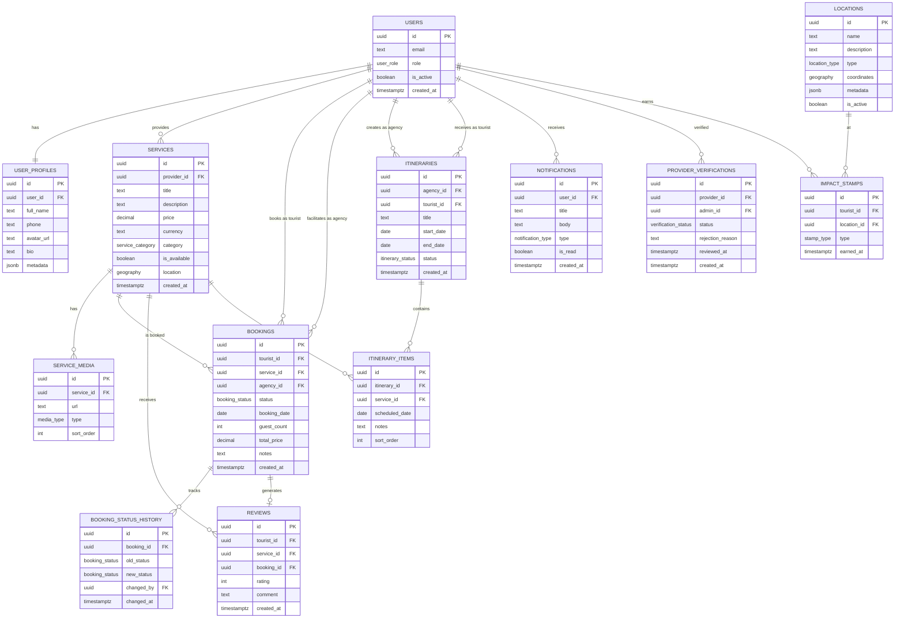

# Database Schema — Uzbekistan Digital Tourism Ecosystem

**Version:** 1.0  
**Date:** 2026-07-16  
**Database:** PostgreSQL 15 (via Supabase)  
**Extensions:** PostGIS, pg_cron, pgcrypto

---

## Table of Contents

1. [Schema Overview](#1-schema-overview)
2. [Entity-Relationship Diagram](#2-entity-relationship-diagram)
3. [Table Definitions](#3-table-definitions)
4. [Enums & Custom Types](#4-enums--custom-types)
5. [Row-Level Security (RLS) Policies](#5-row-level-security-rls-policies)
6. [PostGIS Spatial Design](#6-postgis-spatial-design)
7. [Indexes](#7-indexes)
8. [Seed Data Examples](#8-seed-data-examples)
9. [Migration Strategy](#9-migration-strategy)

---

## 1. Schema Overview

The database is designed around a **central booking transaction model** that connects four user types (Tourist, Provider, Agency, Admin) through a unified relational structure.

### Core Principle

> The `bookings` table is the **heart of the system** — it is the bridge where the shadow economy (`services`) meets formal demand (`users` as Tourists and Agencies).

### Table Summary

| Table | Purpose | Primary Relations |
|---|---|---|
| `users` | All 4 user types, distinguished by role | Central identity table |
| `user_profiles` | Extended profile data per user type | → `users` |
| `services` | Offerings created by Local Providers | → `users` (provider) |
| `service_media` | Photos/videos for services | → `services` |
| `bookings` | Central transaction table | → `users` (tourist), `services`, `users` (agency) |
| `booking_status_history` | Audit trail for booking state changes | → `bookings` |
| `locations` | Spatial data for maps | Independent geospatial data |
| `reviews` | Tourist reviews of services | → `users`, `services`, `bookings` |
| `itineraries` | Agency-created trip plans | → `users` (agency), `users` (tourist) |
| `itinerary_items` | Individual items within an itinerary | → `itineraries`, `services` |
| `notifications` | Push notification records | → `users` |
| `provider_verifications` | Admin verification workflow | → `users` (provider), `users` (admin) |
| `impact_stamps` | Digital stamps for Impact Passport | → `users` (tourist), `locations` |
| `analytics_events` | Platform analytics event log | → `users` |

---

## 2. Entity-Relationship Diagram



---

## 3. Table Definitions

### 3.1 `users`

The central identity table for all four user types. Linked to Supabase Auth via `id`.

| Column | Type | Constraints | Description |
|---|---|---|---|
| `id` | `uuid` | PK, default `auth.uid()` | Matches Supabase Auth user ID |
| `email` | `text` | UNIQUE, NOT NULL | User's email address |
| `role` | `user_role` | NOT NULL | Enum: `tourist`, `provider`, `agency`, `admin` |
| `is_active` | `boolean` | DEFAULT `true` | Soft-delete flag |
| `is_verified` | `boolean` | DEFAULT `false` | Admin verification status (for providers) |
| `created_at` | `timestamptz` | DEFAULT `now()` | Account creation timestamp |
| `updated_at` | `timestamptz` | DEFAULT `now()` | Last update timestamp |

### 3.2 `user_profiles`

Extended profile data. Schema varies by `role` via the `metadata` JSONB field.

| Column | Type | Constraints | Description |
|---|---|---|---|
| `id` | `uuid` | PK, default `gen_random_uuid()` | Profile ID |
| `user_id` | `uuid` | FK → `users.id`, UNIQUE | One profile per user |
| `full_name` | `text` | NOT NULL | Display name |
| `phone` | `text` | | Phone number |
| `avatar_url` | `text` | | Profile photo URL |
| `bio` | `text` | | Short biography |
| `language` | `text` | DEFAULT `'en'` | Preferred language code |
| `country` | `text` | | Country of origin (tourists) |
| `metadata` | `jsonb` | DEFAULT `'{}'` | Role-specific data (see below) |
| `created_at` | `timestamptz` | DEFAULT `now()` | |
| `updated_at` | `timestamptz` | DEFAULT `now()` | |

**Metadata by role:**

```jsonc
// Tourist
{ "passport_country": "US", "dietary_restrictions": ["halal", "nut-allergy"], "travel_dates": { "arrival": "2026-08-01", "departure": "2026-08-14" } }

// Provider
{ "business_name": "Rustam's Yurt Camp", "address": "Nurata District", "bank_details": { "card_number": "8600****1234" } }

// Agency
{ "company_name": "Silk Road Adventures", "license_number": "DMC-2024-0042", "team_size": 5 }

// Admin
{ "department": "Tourism Quality Assurance", "access_level": "super_admin" }
```

### 3.3 `services`

Offerings created by Local Providers (yurt stays, masterclasses, camel rides, etc.).

| Column | Type | Constraints | Description |
|---|---|---|---|
| `id` | `uuid` | PK, default `gen_random_uuid()` | Service ID |
| `provider_id` | `uuid` | FK → `users.id`, NOT NULL | Provider who created this service |
| `title` | `text` | NOT NULL | Service name (AI-translated) |
| `title_uz` | `text` | | Original Uzbek title |
| `title_ru` | `text` | | Russian title |
| `description` | `text` | NOT NULL | Service description |
| `description_uz` | `text` | | Original Uzbek description |
| `description_ru` | `text` | | Russian description |
| `category` | `service_category` | NOT NULL | Enum: see custom types |
| `price` | `decimal(10,2)` | NOT NULL | Price per person |
| `currency` | `text` | DEFAULT `'UZS'` | Currency code |
| `duration_minutes` | `integer` | | Duration of the experience |
| `max_guests` | `integer` | DEFAULT `10` | Maximum group size |
| `is_available` | `boolean` | DEFAULT `false` | Provider's online/offline toggle |
| `location` | `geography(Point, 4326)` | | PostGIS point for geospatial queries |
| `address` | `text` | | Human-readable address |
| `city` | `text` | | City/district name |
| `region` | `text` | | Region/province |
| `rating_avg` | `decimal(2,1)` | DEFAULT `0.0` | Cached average rating |
| `rating_count` | `integer` | DEFAULT `0` | Cached review count |
| `created_at` | `timestamptz` | DEFAULT `now()` | |
| `updated_at` | `timestamptz` | DEFAULT `now()` | |

### 3.4 `service_media`

Photos and videos associated with services.

| Column | Type | Constraints | Description |
|---|---|---|---|
| `id` | `uuid` | PK, default `gen_random_uuid()` | Media ID |
| `service_id` | `uuid` | FK → `services.id`, ON DELETE CASCADE | Parent service |
| `url` | `text` | NOT NULL | Supabase Storage URL |
| `type` | `media_type` | NOT NULL | Enum: `photo`, `video` |
| `alt_text` | `text` | | Accessibility description |
| `sort_order` | `integer` | DEFAULT `0` | Display order |
| `created_at` | `timestamptz` | DEFAULT `now()` | |

### 3.5 `bookings`

The central transaction table connecting tourists, services, and agencies.

| Column | Type | Constraints | Description |
|---|---|---|---|
| `id` | `uuid` | PK, default `gen_random_uuid()` | Booking ID |
| `tourist_id` | `uuid` | FK → `users.id`, NOT NULL | The tourist making the booking |
| `service_id` | `uuid` | FK → `services.id`, NOT NULL | The booked service |
| `agency_id` | `uuid` | FK → `users.id`, NULLABLE | Agency facilitating (null for direct bookings) |
| `status` | `booking_status` | DEFAULT `'pending'` | Current booking state |
| `booking_date` | `date` | NOT NULL | Date of the experience |
| `guest_count` | `integer` | NOT NULL, DEFAULT `1` | Number of guests |
| `total_price` | `decimal(12,2)` | NOT NULL | Total calculated price |
| `currency` | `text` | DEFAULT `'UZS'` | Currency code |
| `notes` | `text` | | Special requests |
| `cancellation_reason` | `text` | | Reason if cancelled |
| `payment_status` | `payment_status` | DEFAULT `'unpaid'` | Payment tracking |
| `created_at` | `timestamptz` | DEFAULT `now()` | |
| `updated_at` | `timestamptz` | DEFAULT `now()` | |

### 3.6 `booking_status_history`

Audit trail for all booking state transitions.

| Column | Type | Constraints | Description |
|---|---|---|---|
| `id` | `uuid` | PK, default `gen_random_uuid()` | History entry ID |
| `booking_id` | `uuid` | FK → `bookings.id`, ON DELETE CASCADE | Parent booking |
| `old_status` | `booking_status` | | Previous status |
| `new_status` | `booking_status` | NOT NULL | New status |
| `changed_by` | `uuid` | FK → `users.id` | User who triggered the change |
| `notes` | `text` | | Additional context |
| `changed_at` | `timestamptz` | DEFAULT `now()` | |

### 3.7 `locations`

Spatial data for Survival Maps (SOS hubs, toilets) and Heatmap tracking.

| Column | Type | Constraints | Description |
|---|---|---|---|
| `id` | `uuid` | PK, default `gen_random_uuid()` | Location ID |
| `name` | `text` | NOT NULL | Location name |
| `name_uz` | `text` | | Uzbek name |
| `name_ru` | `text` | | Russian name |
| `description` | `text` | | Description of the location |
| `type` | `location_type` | NOT NULL | Enum: see custom types |
| `coordinates` | `geography(Point, 4326)` | NOT NULL | PostGIS point |
| `address` | `text` | | Street address |
| `city` | `text` | | City |
| `region` | `text` | | Region |
| `phone` | `text` | | Contact phone (for SOS) |
| `operating_hours` | `jsonb` | | Opening/closing times |
| `metadata` | `jsonb` | DEFAULT `'{}'` | Type-specific data |
| `is_active` | `boolean` | DEFAULT `true` | Active/inactive flag |
| `verified_by` | `uuid` | FK → `users.id` | Admin who verified |
| `created_at` | `timestamptz` | DEFAULT `now()` | |
| `updated_at` | `timestamptz` | DEFAULT `now()` | |

### 3.8 `reviews`

Tourist reviews of completed services.

| Column | Type | Constraints | Description |
|---|---|---|---|
| `id` | `uuid` | PK, default `gen_random_uuid()` | Review ID |
| `tourist_id` | `uuid` | FK → `users.id`, NOT NULL | Reviewing tourist |
| `service_id` | `uuid` | FK → `services.id`, NOT NULL | Reviewed service |
| `booking_id` | `uuid` | FK → `bookings.id`, UNIQUE | One review per booking |
| `rating` | `integer` | NOT NULL, CHECK `1-5` | Star rating |
| `comment` | `text` | | Review text |
| `created_at` | `timestamptz` | DEFAULT `now()` | |

### 3.9 `itineraries`

Trip plans created by agencies for tourists.

| Column | Type | Constraints | Description |
|---|---|---|---|
| `id` | `uuid` | PK, default `gen_random_uuid()` | Itinerary ID |
| `agency_id` | `uuid` | FK → `users.id`, NOT NULL | Creating agency |
| `tourist_id` | `uuid` | FK → `users.id` | Assigned tourist (nullable during draft) |
| `title` | `text` | NOT NULL | Trip name |
| `description` | `text` | | Trip overview |
| `start_date` | `date` | | Trip start |
| `end_date` | `date` | | Trip end |
| `status` | `itinerary_status` | DEFAULT `'draft'` | Enum: `draft`, `proposed`, `accepted`, `active`, `completed` |
| `total_estimated_cost` | `decimal(12,2)` | | Sum of all itinerary items |
| `currency` | `text` | DEFAULT `'UZS'` | Currency code |
| `created_at` | `timestamptz` | DEFAULT `now()` | |
| `updated_at` | `timestamptz` | DEFAULT `now()` | |

### 3.10 `itinerary_items`

Individual services scheduled within an itinerary.

| Column | Type | Constraints | Description |
|---|---|---|---|
| `id` | `uuid` | PK, default `gen_random_uuid()` | Item ID |
| `itinerary_id` | `uuid` | FK → `itineraries.id`, ON DELETE CASCADE | Parent itinerary |
| `service_id` | `uuid` | FK → `services.id` | Linked service (nullable for custom items) |
| `title` | `text` | NOT NULL | Item label |
| `scheduled_date` | `date` | NOT NULL | Day of the experience |
| `start_time` | `time` | | Scheduled time |
| `duration_minutes` | `integer` | | Expected duration |
| `price` | `decimal(10,2)` | | Item cost |
| `notes` | `text` | | Special instructions |
| `sort_order` | `integer` | DEFAULT `0` | Order within the day |
| `created_at` | `timestamptz` | DEFAULT `now()` | |

### 3.11 `notifications`

Push notification records for all user types.

| Column | Type | Constraints | Description |
|---|---|---|---|
| `id` | `uuid` | PK, default `gen_random_uuid()` | Notification ID |
| `user_id` | `uuid` | FK → `users.id`, NOT NULL | Recipient |
| `title` | `text` | NOT NULL | Notification title |
| `body` | `text` | NOT NULL | Notification body |
| `type` | `notification_type` | NOT NULL | Enum: see custom types |
| `action_url` | `text` | | Deep link URL |
| `is_read` | `boolean` | DEFAULT `false` | Read status |
| `created_at` | `timestamptz` | DEFAULT `now()` | |

### 3.12 `provider_verifications`

Admin workflow for verifying new local providers.

| Column | Type | Constraints | Description |
|---|---|---|---|
| `id` | `uuid` | PK, default `gen_random_uuid()` | Verification ID |
| `provider_id` | `uuid` | FK → `users.id`, NOT NULL | Provider under review |
| `admin_id` | `uuid` | FK → `users.id` | Reviewing admin |
| `status` | `verification_status` | DEFAULT `'pending'` | Enum: `pending`, `approved`, `rejected` |
| `documents_url` | `text` | | Uploaded verification documents |
| `rejection_reason` | `text` | | Reason if rejected |
| `reviewed_at` | `timestamptz` | | When admin reviewed |
| `created_at` | `timestamptz` | DEFAULT `now()` | |

### 3.13 `impact_stamps`

Digital stamps earned by tourists for visiting rural areas or eco-friendly actions.

| Column | Type | Constraints | Description |
|---|---|---|---|
| `id` | `uuid` | PK, default `gen_random_uuid()` | Stamp ID |
| `tourist_id` | `uuid` | FK → `users.id`, NOT NULL | Earning tourist |
| `location_id` | `uuid` | FK → `locations.id` | Location where earned |
| `type` | `stamp_type` | NOT NULL | Enum: see custom types |
| `earned_at` | `timestamptz` | DEFAULT `now()` | |

### 3.14 `analytics_events`

Platform event log for admin analytics dashboard.

| Column | Type | Constraints | Description |
|---|---|---|---|
| `id` | `uuid` | PK, default `gen_random_uuid()` | Event ID |
| `user_id` | `uuid` | FK → `users.id` | Acting user (nullable for anonymous) |
| `event_name` | `text` | NOT NULL | e.g., `page_view`, `booking_created`, `search_performed` |
| `properties` | `jsonb` | DEFAULT `'{}'` | Event-specific data |
| `session_id` | `text` | | Browser session identifier |
| `user_agent` | `text` | | Browser/device info |
| `ip_address` | `inet` | | Anonymized IP |
| `created_at` | `timestamptz` | DEFAULT `now()` | |

---

## 4. Enums & Custom Types

```sql
-- User roles
CREATE TYPE user_role AS ENUM ('tourist', 'provider', 'agency', 'admin');

-- Service categories
CREATE TYPE service_category AS ENUM (
  'masterclass',      -- Tandir baking, ceramic making, etc.
  'accommodation',    -- Yurt stays, B&Bs, guesthouses
  'adventure',        -- Camel riding, hiking, horse riding
  'food_experience',  -- Traditional cooking, choyxona visits
  'cultural_tour',    -- Historical site guides, craft workshops
  'transport',        -- Local drivers, horse carts
  'other'
);

-- Booking status workflow
CREATE TYPE booking_status AS ENUM (
  'pending',          -- Tourist submitted, waiting for provider
  'accepted',         -- Provider accepted
  'declined',         -- Provider declined
  'confirmed',        -- Payment confirmed (if applicable)
  'in_progress',      -- Experience is happening
  'completed',        -- Experience finished
  'cancelled',        -- Cancelled by tourist or agency
  'no_show'           -- Tourist didn't show up
);

-- Payment status
CREATE TYPE payment_status AS ENUM (
  'unpaid',
  'pending',
  'paid',
  'refunded',
  'failed'
);

-- Location types for Survival Map
CREATE TYPE location_type AS ENUM (
  'sos_hub',          -- Emergency contact / tourist police
  'clean_toilet',     -- Verified clean public toilet
  'cultural_site',    -- Monument, mosque, historical site
  'festival',         -- Active local festival
  'pharmacy',         -- Pharmacy / medical
  'atm',              -- ATM / currency exchange
  'wifi_hotspot',     -- Free WiFi locations
  'water_station'     -- Clean drinking water
);

-- Media types
CREATE TYPE media_type AS ENUM ('photo', 'video');

-- Notification types
CREATE TYPE notification_type AS ENUM (
  'booking_request',       -- New booking for provider
  'booking_accepted',      -- Provider accepted booking
  'booking_declined',      -- Provider declined booking
  'booking_cancelled',     -- Booking cancelled
  'booking_reminder',      -- Upcoming booking reminder
  'weather_alert',         -- Contextual weather notification
  'cultural_tip',          -- Cultural advice notification
  'verification_update',   -- Provider verification status change
  'system'                 -- System announcements
);

-- Itinerary status
CREATE TYPE itinerary_status AS ENUM (
  'draft',       -- Agency is building it
  'proposed',    -- Sent to tourist for review
  'accepted',    -- Tourist approved
  'active',      -- Trip is in progress
  'completed'    -- Trip finished
);

-- Verification status
CREATE TYPE verification_status AS ENUM ('pending', 'approved', 'rejected');

-- Impact stamp types
CREATE TYPE stamp_type AS ENUM (
  'rural_visit',        -- Visited a rural area
  'eco_transport',      -- Used eco-friendly transport
  'cultural_activity',  -- Participated in cultural experience
  'local_cuisine',      -- Tried local food experience
  'hidden_gem'          -- Visited an off-the-beaten-path location
);
```

---

## 5. Row-Level Security (RLS) Policies

All tables have RLS **enabled**. Below are the key policies.

### 5.1 `users` Policies

```sql
-- Users can read their own profile
CREATE POLICY "Users can view own profile"
  ON users FOR SELECT
  USING (auth.uid() = id);

-- Admins can view all users
CREATE POLICY "Admins can view all users"
  ON users FOR SELECT
  USING (
    EXISTS (
      SELECT 1 FROM users WHERE id = auth.uid() AND role = 'admin'
    )
  );

-- Agencies can view providers (for inventory)
CREATE POLICY "Agencies can view providers"
  ON users FOR SELECT
  USING (
    role = 'provider'
    AND EXISTS (
      SELECT 1 FROM users WHERE id = auth.uid() AND role = 'agency'
    )
  );
```

### 5.2 `services` Policies

```sql
-- Anyone authenticated can view available services
CREATE POLICY "Authenticated users can view available services"
  ON services FOR SELECT
  USING (is_available = true OR provider_id = auth.uid());

-- Providers can only manage their own services
CREATE POLICY "Providers manage own services"
  ON services FOR ALL
  USING (provider_id = auth.uid());

-- Admins can view all services
CREATE POLICY "Admins can view all services"
  ON services FOR SELECT
  USING (
    EXISTS (
      SELECT 1 FROM users WHERE id = auth.uid() AND role = 'admin'
    )
  );
```

### 5.3 `bookings` Policies

```sql
-- Tourists can view their own bookings
CREATE POLICY "Tourists view own bookings"
  ON bookings FOR SELECT
  USING (tourist_id = auth.uid());

-- Providers can view bookings for their services
CREATE POLICY "Providers view bookings for their services"
  ON bookings FOR SELECT
  USING (
    service_id IN (
      SELECT id FROM services WHERE provider_id = auth.uid()
    )
  );

-- Agencies can view bookings they facilitated
CREATE POLICY "Agencies view facilitated bookings"
  ON bookings FOR SELECT
  USING (agency_id = auth.uid());

-- Tourists can create bookings
CREATE POLICY "Tourists can create bookings"
  ON bookings FOR INSERT
  WITH CHECK (tourist_id = auth.uid());

-- Providers can update booking status (accept/decline)
CREATE POLICY "Providers can update booking status"
  ON bookings FOR UPDATE
  USING (
    service_id IN (
      SELECT id FROM services WHERE provider_id = auth.uid()
    )
  );
```

### 5.4 `locations` Policies

```sql
-- All authenticated users can view active locations
CREATE POLICY "View active locations"
  ON locations FOR SELECT
  USING (is_active = true);

-- Only admins can manage locations
CREATE POLICY "Admins manage locations"
  ON locations FOR ALL
  USING (
    EXISTS (
      SELECT 1 FROM users WHERE id = auth.uid() AND role = 'admin'
    )
  );
```

---

## 6. PostGIS Spatial Design

### 6.1 Spatial Columns

| Table | Column | Type | SRID | Usage |
|---|---|---|---|---|
| `services` | `location` | `geography(Point, 4326)` | WGS 84 | Provider service geolocation |
| `locations` | `coordinates` | `geography(Point, 4326)` | WGS 84 | Map pins (SOS, toilets, sites) |

### 6.2 Common Spatial Queries

**Find services within N km of a point:**
```sql
SELECT id, title, price,
  ST_Distance(location, ST_MakePoint(66.9597, 39.6542)::geography) AS distance_m
FROM services
WHERE is_available = true
  AND ST_DWithin(location, ST_MakePoint(66.9597, 39.6542)::geography, 50000) -- 50km radius
ORDER BY distance_m;
```

**Find nearest SOS hub to a tourist's position:**
```sql
SELECT id, name, phone,
  ST_Distance(coordinates, ST_MakePoint(:lng, :lat)::geography) AS distance_m
FROM locations
WHERE type = 'sos_hub' AND is_active = true
ORDER BY coordinates <-> ST_MakePoint(:lng, :lat)::geography
LIMIT 5;
```

**Generate heatmap data (tourist clustering):**
```sql
SELECT
  ST_SnapToGrid(
    ST_Transform(coordinates::geometry, 3857), 500 -- 500m grid cells
  ) AS grid_cell,
  COUNT(*) AS density
FROM analytics_events
WHERE event_name = 'location_ping'
  AND created_at > NOW() - INTERVAL '1 hour'
GROUP BY grid_cell
ORDER BY density DESC;
```

### 6.3 Spatial Indexes

```sql
CREATE INDEX idx_services_location ON services USING GIST (location);
CREATE INDEX idx_locations_coordinates ON locations USING GIST (coordinates);
```

---

## 7. Indexes

### 7.1 Primary Indexes (Auto-created)

All primary key columns (`id`) automatically have unique B-tree indexes.

### 7.2 Foreign Key Indexes

```sql
-- users
CREATE INDEX idx_users_role ON users (role);
CREATE INDEX idx_users_email ON users (email);

-- user_profiles
CREATE INDEX idx_user_profiles_user_id ON user_profiles (user_id);

-- services
CREATE INDEX idx_services_provider_id ON services (provider_id);
CREATE INDEX idx_services_category ON services (category);
CREATE INDEX idx_services_is_available ON services (is_available);
CREATE INDEX idx_services_city ON services (city);

-- bookings
CREATE INDEX idx_bookings_tourist_id ON bookings (tourist_id);
CREATE INDEX idx_bookings_service_id ON bookings (service_id);
CREATE INDEX idx_bookings_agency_id ON bookings (agency_id);
CREATE INDEX idx_bookings_status ON bookings (status);
CREATE INDEX idx_bookings_date ON bookings (booking_date);

-- reviews
CREATE INDEX idx_reviews_service_id ON reviews (service_id);
CREATE INDEX idx_reviews_tourist_id ON reviews (tourist_id);

-- itineraries
CREATE INDEX idx_itineraries_agency_id ON itineraries (agency_id);
CREATE INDEX idx_itineraries_tourist_id ON itineraries (tourist_id);

-- notifications
CREATE INDEX idx_notifications_user_id ON notifications (user_id);
CREATE INDEX idx_notifications_is_read ON notifications (is_read);

-- analytics
CREATE INDEX idx_analytics_event_name ON analytics_events (event_name);
CREATE INDEX idx_analytics_created_at ON analytics_events (created_at);
CREATE INDEX idx_analytics_user_id ON analytics_events (user_id);
```

---

## 8. Seed Data Examples

### 8.1 Sample Users

```sql
INSERT INTO users (id, email, role, is_active, is_verified) VALUES
  ('a1b2c3d4-0001-4000-8000-000000000001', 'tourist@example.com', 'tourist', true, true),
  ('a1b2c3d4-0002-4000-8000-000000000002', 'rustam@provider.uz', 'provider', true, true),
  ('a1b2c3d4-0003-4000-8000-000000000003', 'silkroad@agency.uz', 'agency', true, true),
  ('a1b2c3d4-0004-4000-8000-000000000004', 'admin@platform.uz', 'admin', true, true);
```

### 8.2 Sample Services

```sql
INSERT INTO services (id, provider_id, title, description, category, price, currency, duration_minutes, max_guests, is_available, location, city, region)
VALUES
  (
    gen_random_uuid(),
    'a1b2c3d4-0002-4000-8000-000000000002',
    'Traditional Tandir Bread Baking Masterclass',
    'Learn to bake traditional Uzbek bread in a clay tandir oven with master baker Rustam. Includes hands-on experience, tea, and fresh bread to take home.',
    'masterclass',
    150000.00,
    'UZS',
    120,
    8,
    true,
    ST_MakePoint(66.9597, 39.6542)::geography, -- Samarkand
    'Samarkand',
    'Samarkand Region'
  ),
  (
    gen_random_uuid(),
    'a1b2c3d4-0002-4000-8000-000000000002',
    'Desert Camel Riding Experience',
    'A 2-hour camel ride through the Kyzylkum Desert with a local Bedouin guide. Includes traditional tea ceremony at a desert camp.',
    'adventure',
    300000.00,
    'UZS',
    120,
    6,
    true,
    ST_MakePoint(62.8578, 41.5513)::geography, -- Nurata
    'Nurata',
    'Navoi Region'
  );
```

### 8.3 Sample Locations (Survival Map)

```sql
INSERT INTO locations (id, name, description, type, coordinates, city, region, is_active)
VALUES
  (gen_random_uuid(), 'Tourist Police HQ - Samarkand', 'Main tourist police station. English-speaking officers available 24/7.', 'sos_hub', ST_MakePoint(66.9597, 39.6542)::geography, 'Samarkand', 'Samarkand Region', true),
  (gen_random_uuid(), 'Registan Square Public Toilet', 'Clean, maintained public restroom near Registan Square entrance.', 'clean_toilet', ST_MakePoint(66.9756, 39.6548)::geography, 'Samarkand', 'Samarkand Region', true),
  (gen_random_uuid(), 'Bibi-Khanym Mosque', 'Historic 15th-century mosque. Dress code required: knees and shoulders covered.', 'cultural_site', ST_MakePoint(66.9787, 39.6601)::geography, 'Samarkand', 'Samarkand Region', true);
```

---

## 9. Migration Strategy

### 9.1 Tooling

All migrations are managed via **Supabase CLI** and stored in the `supabase/migrations/` directory within the monorepo.

### 9.2 Migration Workflow

```bash
# Create a new migration
pnpm supabase migration new create_users_table

# Apply migrations locally
pnpm supabase db reset

# Push to staging/production
pnpm supabase db push
```

### 9.3 Migration Naming Convention

```
YYYYMMDDHHMMSS_description.sql

# Examples:
20260716120000_create_enums.sql
20260716120001_create_users_table.sql
20260716120002_create_services_table.sql
20260716120003_create_bookings_table.sql
20260716120004_create_locations_table.sql
20260716120005_enable_rls_policies.sql
20260716120006_create_spatial_indexes.sql
20260716120007_seed_initial_data.sql
```

### 9.4 Branching Strategy

Supabase supports **database branching** for preview environments. Each PR gets its own isolated database branch, ensuring that schema changes are tested before merging to production.

---

*This schema is designed for the MVP phase. Tables and columns will be added as features progress through Level 2–4 of the roadmap.*
