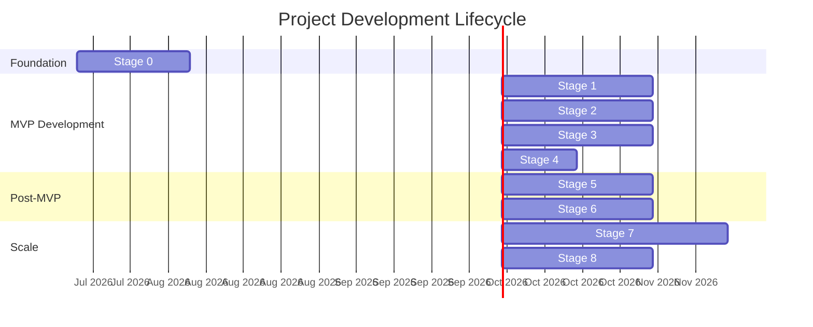

# Project Development Lifecycle — Uzbekistan Digital Tourism Ecosystem

**Version:** 1.0  
**Date:** 2026-07-16  
**Status:** Active  
**Purpose:** Track staged project development from inception to full production launch.

---

## Table of Contents

1. [Lifecycle Overview](#1-lifecycle-overview)
2. [Stage 0 — Foundation & Setup](#2-stage-0--foundation--setup)
3. [Stage 1 — Core MVP: Informational Layer](#3-stage-1--core-mvp-informational-layer)
4. [Stage 2 — Core MVP: Interactive Layer](#4-stage-2--core-mvp-interactive-layer)
5. [Stage 3 — Core MVP: Ecosystem Layer](#5-stage-3--core-mvp-ecosystem-layer)
6. [Stage 4 — MVP Polish & Demo Preparation](#6-stage-4--mvp-polish--demo-preparation)
7. [Stage 5 — Post-MVP: Engagement Features](#7-stage-5--post-mvp-engagement-features)
8. [Stage 6 — Post-MVP: Government & Compliance](#8-stage-6--post-mvp-government--compliance)
9. [Stage 7 — Scale: Deep Tech Integration](#9-stage-7--scale-deep-tech-integration)
10. [Stage 8 — Launch & Growth](#10-stage-8--launch--growth)
11. [Progress Tracking Dashboard](#11-progress-tracking-dashboard)
12. [Risk Register](#12-risk-register)
13. [Milestone Calendar](#13-milestone-calendar)

---

## 1. Lifecycle Overview

### Stage Map



### Summary Table

| Stage | Name | Duration | Focus | Blueprint Level |
|---|---|---|---|---|
| **0** | Foundation & Setup | 3 weeks | Infrastructure, tooling, design system | Pre-Level 1 |
| **1** | Informational Layer | 4 weeks | Maps, translator, auth across all portals | Level 1 |
| **2** | Interactive Layer | 4 weeks | Menu scanner, provider toggle, bookings | Level 2 |
| **3** | Ecosystem Layer | 4 weeks | Itinerary canvas, micro-franchise, admin hub | Level 3 |
| **4** | MVP Polish & Demo | 2 weeks | Integration testing, demo prep, pitch deck | Level 1–3 |
| **5** | Engagement Features | 4 weeks | Impact Passport, notifications, heatmap | Level 2 |
| **6** | Gov & Compliance | 4 weeks | E-Mehmon automation, OCR scanning | Level 3 |
| **7** | Deep Tech | 6 weeks | Crowd-shifting API, resource pooling | Level 4 |
| **8** | Launch & Growth | 4 weeks | Public launch, marketing, optimization | Post-Level 4 |

### Key Milestones

| Milestone | Stage | Target Date | Significance |
|---|---|---|---|
| 🏗️ **Dev Environment Ready** | 0 | Week 3 | Team can begin feature development |
| 🗺️ **First Map Render** | 1 | Week 5 | Tourist app shows live Survival Map |
| 📱 **First PWA Install** | 1 | Week 7 | Tourist app installable on mobile |
| 🤝 **First End-to-End Booking** | 2 | Week 11 | Tourist → Provider booking works |
| 🎯 **MVP Feature Complete** | 3 | Week 15 | All 4 portals functional |
| 🎪 **Demo Day** | 4 | Week 17 | MVP presented to stakeholders |
| 🏛️ **Gov Integration Ready** | 6 | Week 25 | E-Mehmon automation operational |
| 🚀 **Public Launch** | 8 | Week 35 | Platform goes live |

---

## 2. Stage 0 — Foundation & Setup

> **Duration:** 3 weeks  
> **Goal:** Establish the technical foundation so all team members can develop features in parallel.

### Objectives

- Set up the Turborepo monorepo with all four app shells
- Configure Supabase project with initial database schema
- Establish CI/CD pipeline with GitHub Actions + Vercel
- Build the shared design system foundation
- Create development documentation

### Deliverables Checklist

- [ ] **Monorepo initialized** with Turborepo + pnpm workspaces
  - [ ] `apps/tourist-webapp` — Next.js 14 app shell
  - [ ] `apps/provider-app` — Next.js 14 app shell
  - [ ] `apps/agency-portal` — Next.js 14 app shell
  - [ ] `apps/admin-portal` — Next.js 14 app shell
- [ ] **Shared packages created**
  - [ ] `packages/ui` — Tailwind config + base components (Button, Card, Input)
  - [ ] `packages/database` — Supabase client initialization
  - [ ] `packages/auth` — Supabase Auth wrapper
  - [ ] `packages/types` — Shared TypeScript types
  - [ ] `packages/config` — ESLint, Prettier, TypeScript base configs
- [ ] **Database schema deployed**
  - [ ] Core tables created (`users`, `user_profiles`, `services`, `bookings`, `locations`)
  - [ ] Enums defined (`user_role`, `service_category`, `booking_status`, etc.)
  - [ ] PostGIS extension enabled
  - [ ] RLS policies for `users` and `user_profiles` tables
  - [ ] Seed data loaded (test users, sample services, sample locations)
- [ ] **CI/CD pipeline operational**
  - [ ] GitHub Actions: lint → type-check → unit tests → build
  - [ ] Vercel preview deploys working for all 4 apps
  - [ ] Supabase CLI integrated for migration management
- [ ] **Development environment documented**
  - [ ] `.env.example` with all required variables
  - [ ] `README.md` with setup instructions
  - [ ] `CONTRIBUTING.md` in place
- [ ] **Design system foundations**
  - [ ] Color palette tokens defined in Tailwind
  - [ ] Typography scale configured
  - [ ] Core components: Button, Card, Input, Badge, Avatar

### Dependencies

- Supabase account created and project provisioned
- Vercel account linked to GitHub repository
- Mapbox and OpenAI API keys obtained

### Success Criteria

✅ Any team member can clone → install → run all 4 apps locally in under 10 minutes  
✅ CI pipeline catches lint errors and type errors on every push  
✅ Preview deploys auto-generate for every PR

---

## 3. Stage 1 — Core MVP: Informational Layer

> **Duration:** 4 weeks  
> **Goal:** Build the trust-building features that keep tourists relying on the platform. Establish authentication across all portals.

### Objectives

- Implement Supabase Auth across all four portals
- Build the Survival Map with categorized pins
- Create the Contextual Translator
- Ensure Tourist and Provider apps are installable as PWAs

### Deliverables Checklist

#### Authentication (All Portals)
- [ ] Tourist registration/login (email + Google OAuth)
- [ ] Provider registration/login (email + phone OTP)
- [ ] Agency registration/login (email + Google OAuth)
- [ ] Admin registration/login (email + MFA)
- [ ] Protected routes — redirect unauthenticated users
- [ ] User profile creation flow (per role)
- [ ] Session management with token refresh

#### Tourist WebApp
- [ ] **Survival Map (F-T01)**
  - [ ] Mapbox GL JS integrated and rendering
  - [ ] Map pins loaded from `locations` table (PostGIS queries)
  - [ ] Pin categories: SOS, toilet, cultural site, pharmacy, ATM, WiFi, water
  - [ ] Pin tap → info card (name, description, phone, "Get Directions")
  - [ ] User's current location shown on map
  - [ ] Map data cached for offline access via Service Worker
- [ ] **Contextual Translator (F-T04)**
  - [ ] Text input → OpenAI translation (Uzbek/Russian ↔ English)
  - [ ] Cultural context notes included in responses
  - [ ] Common phrases pre-loaded for quick access
  - [ ] Translation history saved locally
- [ ] **PWA Configuration**
  - [ ] Web App Manifest with icons and theme color
  - [ ] Service Worker with Workbox for asset caching
  - [ ] Offline fallback page
  - [ ] Install prompt on first visit

#### Provider App
- [ ] **PWA Configuration** (same as Tourist)
- [ ] Basic profile view (name, phone, role indicator)

#### Tests
- [ ] Unit tests for map utility functions
- [ ] Unit tests for translator API wrapper
- [ ] Integration tests for auth flows (all 4 roles)
- [ ] E2E: Tourist registers → views Survival Map → taps pin

### Dependencies

- Stage 0 complete (monorepo, database, CI/CD)
- Mapbox access token active
- OpenAI API key active
- Sample `locations` data seeded (≥ 20 pins in Samarkand/Bukhara)

### Success Criteria

✅ Tourist can install PWA and view a map with working pins in Samarkand  
✅ Tourist can translate a phrase from English to Uzbek  
✅ All 4 portal login screens work with appropriate auth methods  
✅ Offline mode shows cached map data when network is disabled

### Estimated Effort

| Task | Effort |
|---|---|
| Auth implementation (all portals) | 1 week |
| Survival Map | 1.5 weeks |
| Contextual Translator | 1 week |
| PWA setup + testing | 0.5 weeks |

---

## 4. Stage 2 — Core MVP: Interactive Layer

> **Duration:** 4 weeks  
> **Goal:** Enable real interactions between users — bookings, provider management, and agency inventory.

### Objectives

- Build the Taste & Trust menu scanner
- Implement provider Online/Offline toggle with realtime updates
- Create the booking flow (Tourist → Provider)
- Build agency provider inventory dashboard

### Deliverables Checklist

#### Tourist WebApp
- [ ] **Taste & Trust Scanner (F-T02)**
  - [ ] Camera capture UI (button → camera → capture → processing)
  - [ ] Image upload to OpenAI Vision API
  - [ ] Dish cards: translated name, description, allergen icons, dietary flags
  - [ ] User dietary preferences influence warnings
  - [ ] Loading state with shimmer animation
- [ ] **Direct Discovery (F-T03)**
  - [ ] Service listing page (cards from `services` table)
  - [ ] Filter by category, price range, distance
  - [ ] Service detail page with photos, description, reviews
  - [ ] Booking flow: select date → guest count → confirm
  - [ ] Booking confirmation page

#### Provider App
- [ ] **Availability Toggle (F-P01)**
  - [ ] Giant On/Off toggle on main screen
  - [ ] Supabase Realtime broadcast of status change
  - [ ] Visual feedback (green "Online" / gray "Offline")
  - [ ] State persists across app closes
- [ ] **Booking Management (F-P02)**
  - [ ] Push notification on new booking request
  - [ ] Booking request card with Accept/Decline buttons
  - [ ] "My Bookings" list (accepted, upcoming, completed)
  - [ ] Tourist notification on accept/decline

#### Agency Portal
- [ ] **Provider Inventory Dashboard (F-A01)**
  - [ ] Live list of all providers with availability status
  - [ ] Supabase Realtime subscription for status updates
  - [ ] Filters: category, location, price, availability
  - [ ] Provider detail modal with full profile

#### Database
- [ ] RLS policies for `services` table
- [ ] RLS policies for `bookings` table
- [ ] Booking status history trigger (auto-log state changes)
- [ ] `notifications` table and trigger for booking events

#### Tests
- [ ] Unit tests for booking price calculation
- [ ] Integration tests for booking creation + status transitions
- [ ] RLS tests: tourist can't see other tourists' bookings
- [ ] RLS tests: provider can't update another provider's bookings
- [ ] E2E: Tourist books a masterclass → Provider accepts

### Dependencies

- Stage 1 complete (auth, maps, translator)
- Web Push API configured (VAPID keys)
- Service media storage bucket created

### Success Criteria

✅ A tourist can scan a menu and get translated dish cards with allergen warnings  
✅ A tourist can browse services and create a booking  
✅ A provider can toggle Online/Offline and an agency sees the update in real-time  
✅ A provider receives a push notification and accepts a booking  
✅ Full booking flow works end-to-end (tourist → provider)

### Estimated Effort

| Task | Effort |
|---|---|
| Taste & Trust Scanner | 1 week |
| Direct Discovery + Booking | 1.5 weeks |
| Provider toggle + booking management | 1 week |
| Agency inventory dashboard | 0.5 weeks |

---

## 5. Stage 3 — Core MVP: Ecosystem Layer

> **Duration:** 4 weeks  
> **Goal:** Complete the 4-portal ecosystem with the "wow factor" features that demonstrate the platform's unique value.

### Objectives

- Build the Itinerary Canvas for agencies
- Create the Micro-Franchise Profile for providers
- Implement the Admin Verification Hub
- Build the Admin Analytics Dashboard and Heatmap

### Deliverables Checklist

#### Agency Portal
- [ ] **Booking CRM (F-A02)**
  - [ ] Kanban board with columns: Pending → Accepted → Confirmed → Completed
  - [ ] Drag-and-drop cards between columns
  - [ ] Card click → full booking details panel
  - [ ] Filter by date, provider, tourist
- [ ] **Itinerary Canvas V1 (F-A03)**
  - [ ] Calendar view (day columns for trip duration)
  - [ ] Service sidebar (drag from inventory)
  - [ ] Drag-and-drop services onto calendar days
  - [ ] Auto-calculate total itinerary cost
  - [ ] Save itinerary to database
  - [ ] Share itinerary link with tourist

#### Provider App
- [ ] **Micro-Franchise Profile (F-P03)**
  - [ ] Service creation form: title, description, photos (up to 5), price, duration, max guests
  - [ ] AI auto-translation of title and description (Uzbek → English + Russian)
  - [ ] Photo upload to Supabase Storage
  - [ ] Preview card showing how tourists will see the listing
  - [ ] Submit for admin verification

#### Admin Portal
- [ ] **Verification Hub (F-M01)**
  - [ ] Table of pending provider verifications
  - [ ] Click row → review profile, photos, documents
  - [ ] Approve or Reject (with reason)
  - [ ] Provider notification on decision
  - [ ] Approved provider becomes visible to tourists/agencies
- [ ] **Platform Analytics Dashboard (F-M02)**
  - [ ] KPI cards: active tourists, verified providers, bookings, GMV
  - [ ] Line charts for booking trends (daily/weekly/monthly)
  - [ ] Date range selector
  - [ ] Auto-refresh every 5 minutes
- [ ] **Heatmap Oversight (F-M03)**
  - [ ] Full-screen Mapbox map with density overlay
  - [ ] Heatmap data from `analytics_events` (anonymized geo)
  - [ ] City/region filter
  - [ ] Refresh every 60 seconds

#### Database
- [ ] RLS policies for `itineraries` and `itinerary_items` tables
- [ ] RLS policies for `provider_verifications` table
- [ ] Analytics event ingestion from all portals
- [ ] Heatmap aggregation query (PostGIS grid cells)

#### Tests
- [ ] Integration tests for itinerary CRUD
- [ ] Integration tests for provider verification workflow
- [ ] RLS tests: agency can only see own itineraries
- [ ] RLS tests: only admins can manage verifications
- [ ] E2E: Provider creates profile → Admin approves → Appears in agency inventory

### Dependencies

- Stage 2 complete (bookings, provider toggle, agency inventory)
- Chart library integrated (e.g., Recharts or Chart.js)
- Drag-and-drop library (React DnD or dnd-kit)

### Success Criteria

✅ An agency can build a drag-and-drop itinerary with auto-pricing  
✅ A provider can create a full service profile with photos and AI translation  
✅ An admin can verify a provider and they appear in the tourist discovery feed  
✅ An admin can view platform KPIs and a live heatmap of tourist density  
✅ All 4 portals are functionally interconnected

### Estimated Effort

| Task | Effort |
|---|---|
| Booking CRM (Kanban) | 1 week |
| Itinerary Canvas V1 | 1.5 weeks |
| Micro-Franchise Profile | 0.5 weeks |
| Admin Verification Hub | 0.5 weeks |
| Analytics Dashboard + Heatmap | 0.5 weeks |

---

## 6. Stage 4 — MVP Polish & Demo Preparation

> **Duration:** 2 weeks  
> **Goal:** Harden the MVP for stakeholder presentation. Fix bugs, polish UI, and prepare demo materials.

### Objectives

- Comprehensive cross-portal integration testing
- UI polish and consistency review
- Performance optimization (Lighthouse ≥ 90)
- Demo scenario preparation
- Pitch deck / marketing materials

### Deliverables Checklist

#### Quality Assurance
- [ ] Full E2E test suite passing (all 15 critical flows)
- [ ] Cross-browser testing (Chrome, Safari, Firefox)
- [ ] Mobile device testing (iPhone, mid-range Android)
- [ ] PWA installation tested on iOS and Android
- [ ] Lighthouse audit: Performance ≥ 90, Accessibility ≥ 95, PWA ✅
- [ ] Security review: all RLS policies verified with test scripts
- [ ] API rate limiting verified

#### UI Polish
- [ ] Consistent spacing and typography across all portals
- [ ] Loading states and skeleton screens for all data-driven pages
- [ ] Error states and empty states designed and implemented
- [ ] Micro-animations for key interactions (toggle, booking, map pins)
- [ ] Dark mode consistency check (if implemented)

#### Performance
- [ ] Image optimization (next/image, lazy loading)
- [ ] Bundle size analysis and code splitting
- [ ] Map tile caching for common areas (Samarkand, Bukhara, Tashkent)
- [ ] API response time < 200ms (p95)

#### Demo Preparation
- [ ] Demo script with step-by-step walkthrough of all 4 portals
- [ ] Pre-loaded demo data (realistic providers, services, bookings)
- [ ] Demo video recording (5–10 minutes)
- [ ] Pitch deck slides highlighting key features and market opportunity
- [ ] One-page executive summary

### Dependencies

- Stages 0–3 complete
- All critical bugs resolved
- Demo environment deployed (staging)

### Success Criteria

✅ A non-technical stakeholder can understand and be impressed by a live demo  
✅ Lighthouse scores meet targets across all portals  
✅ No P0/P1 bugs remain  
✅ Demo can run for 15 minutes without failures  
✅ Pitch materials are presentation-ready

---

## 7. Stage 5 — Post-MVP: Engagement Features

> **Duration:** 4 weeks  
> **Goal:** Add features that increase tourist engagement, retention, and platform stickiness.

### Objectives

- Implement the Contextual Notification Engine
- Build the Live Hidden Uzbekistan Heatmap (tourist-facing)
- Create the Trust-Based Impact Passport gamification system
- Add the review system

### Deliverables Checklist

- [ ] **Contextual Notification Engine**
  - [ ] Weather-based notifications ("38°C in Khiva tomorrow, wear linen")
  - [ ] Cultural tip notifications ("Cover shoulders at the mosque")
  - [ ] Nearby attraction notifications based on location
  - [ ] User notification preferences (opt-in/opt-out per type)
- [ ] **Live Hidden Uzbekistan Heatmap (Tourist-facing)**
  - [ ] "Trending" vs "Quiet" spots visualization
  - [ ] Tourist-facing map layer showing crowd density
  - [ ] "Escape the Crowds" recommendations
  - [ ] Premium listings for rural cafes/experiences
- [ ] **Impact Passport**
  - [ ] Digital stamp collection UI (stamp card design)
  - [ ] Stamp earning triggers (rural visit, eco-transport, cultural activity)
  - [ ] Geofence-based stamp verification
  - [ ] Progress tracking (X/5 stamps earned)
  - [ ] Reward redemption UI (placeholder for souvenir fulfillment)
- [ ] **Review System**
  - [ ] Post-booking review form (1–5 stars + comment)
  - [ ] Reviews displayed on service detail pages
  - [ ] Average rating calculation and caching
  - [ ] Provider review notification

### Dependencies

- Stage 4 complete (MVP polished and stable)
- Geofencing capability tested
- Notification preferences UI built

### Success Criteria

✅ Tourist receives contextual notifications based on location and weather  
✅ Tourist heatmap helps users discover quiet, off-the-beaten-path locations  
✅ Tourist can earn and view digital stamps  
✅ Tourist can leave reviews that appear on service listings

---

## 8. Stage 6 — Post-MVP: Government & Compliance

> **Duration:** 4 weeks  
> **Goal:** Automate government compliance processes to provide massive value to agencies and position the platform for government partnership.

### Objectives

- Build OCR passport scanning via OpenAI Vision
- Implement E-Mehmon data export (automated form filling)
- Create compliance tracking dashboard for agencies
- Payment integration (Stripe + local Payme/Click)

### Deliverables Checklist

- [ ] **OCR Passport Scanning**
  - [ ] Camera capture for passport photo page
  - [ ] OpenAI Vision extraction of: name, passport number, nationality, DOB
  - [ ] Auto-populate tourist profile fields
  - [ ] Manual correction UI for OCR errors
- [ ] **E-Mehmon Compliance Automation**
  - [ ] E-Mehmon data format specification
  - [ ] Auto-fill form from booking + passport data
  - [ ] Export in E-Mehmon compatible format (CSV/Excel)
  - [ ] Compliance status tracking per tourist
  - [ ] 24-hour deadline reminder notifications
- [ ] **Payment Integration**
  - [ ] Stripe integration for international tourist payments (USD/EUR)
  - [ ] Payme/Click integration for local UZS payments
  - [ ] Provider payout dashboard
  - [ ] Platform commission calculation (10–15%)
  - [ ] Payment status tracking in bookings
- [ ] **Agency Compliance Dashboard**
  - [ ] E-Mehmon registration status per tourist (pending/submitted/confirmed)
  - [ ] Bulk export functionality
  - [ ] Compliance audit log

### Dependencies

- Stage 5 complete
- E-Mehmon data format officially documented
- Stripe account approved for Uzbekistan
- Payme/Click merchant agreement

### Success Criteria

✅ Agency can scan a passport and auto-fill E-Mehmon data  
✅ E-Mehmon export generates correctly formatted file  
✅ Tourist can pay for a booking with Stripe  
✅ Provider receives payout notification after booking completion

---

## 9. Stage 7 — Scale: Deep Tech Integration

> **Duration:** 6 weeks  
> **Goal:** Build the advanced, data-driven features that lock in government support and agency reliance.

### Objectives

- Build the Dynamic Crowd-Shifting Pricing API
- Implement B2B Multi-Agency Resource Pooling
- AI-powered collaborative itinerary enhancements
- Platform scalability hardening

### Deliverables Checklist

- [ ] **Dynamic Crowd-Shifting Pricing API**
  - [ ] AI monitors tourist density at major hubs
  - [ ] Auto-generate discounted alternatives when crowds detected
  - [ ] Push alternative suggestions to agencies/tourists
  - [ ] API for agencies to query optimal routing
  - [ ] Admin dashboard for monitoring crowd patterns
- [ ] **B2B Multi-Agency Resource Pooling**
  - [ ] Agency-to-agency seat sharing marketplace
  - [ ] "Empty seats" listing and discovery
  - [ ] Transaction processing for seat purchases
  - [ ] 5% clearing house fee calculation
  - [ ] B2B transaction reporting
- [ ] **Collaborative AI Itinerary Canvas (Enhanced)**
  - [ ] Tourist ↔ Agency shared canvas (real-time collaboration)
  - [ ] AI route optimization suggestions
  - [ ] Dynamic pricing based on crowd-shifting API
  - [ ] Multi-city itinerary support
- [ ] **Scalability Hardening**
  - [ ] Database read replicas for analytics
  - [ ] Connection pooling optimization
  - [ ] CDN caching strategy for map tiles
  - [ ] Load testing (k6) — 500+ concurrent users
  - [ ] Monitoring and alerting fully operational

### Dependencies

- Stage 6 complete (payments, compliance)
- Sufficient booking data for crowd-shifting AI training
- Government data sharing agreement (for official venue capacity data)

### Success Criteria

✅ Crowd-shifting API suggests alternatives when Registan is overcrowded  
✅ Two agencies can share bus seats through the platform  
✅ Tourist and agency can collaborate on a shared itinerary in real-time  
✅ Platform handles 500+ concurrent users without degradation

---

## 10. Stage 8 — Launch & Growth

> **Duration:** 4 weeks  
> **Goal:** Publicly launch the platform, onboard initial users, and establish growth loops.

### Objectives

- Production environment fully operational
- Marketing launch campaign
- User onboarding flows optimized
- Performance monitoring and rapid iteration

### Deliverables Checklist

- [ ] **Production Launch**
  - [ ] All domains configured (`*.uzbektourism.app`)
  - [ ] SSL certificates active
  - [ ] Cloudflare WAF rules configured
  - [ ] All environment variables set for production
  - [ ] Database backups verified
  - [ ] Monitoring alerts active
- [ ] **User Onboarding**
  - [ ] Tourist onboarding flow (guided tour of key features)
  - [ ] Provider onboarding flow (video tutorial + step-by-step)
  - [ ] Agency onboarding flow (demo call + self-service)
  - [ ] QR codes generated for airports, hotels, tourist spots
- [ ] **Marketing Launch**
  - [ ] Landing page (`uzbektourism.app`)
  - [ ] Social media campaign assets
  - [ ] Partnership outreach to 10 pilot agencies
  - [ ] Provider recruitment in Samarkand + Bukhara (target: 50 providers)
  - [ ] Tourism board presentation
- [ ] **Growth Monitoring**
  - [ ] PostHog funnels tracking onboarding completion
  - [ ] User retention cohort analysis
  - [ ] NPS survey triggered after first booking
  - [ ] Weekly growth metrics report
- [ ] **Rapid Iteration**
  - [ ] Bug reporting flow for users (in-app feedback)
  - [ ] Bi-weekly sprint cycle for bug fixes and improvements
  - [ ] Feature request backlog from user feedback

### Dependencies

- All prior stages complete
- Marketing budget allocated
- Partnership agreements with pilot agencies
- Provider recruitment campaign executed

### Success Criteria

✅ Platform is publicly accessible and stable for 7 consecutive days  
✅ 500 tourist registrations in first 90 days  
✅ 50 verified providers onboarded  
✅ 5 active agency accounts  
✅ 200 bookings processed  
✅ NPS score > 50

---

## 11. Progress Tracking Dashboard

### Overall Progress

| Stage | Status | Progress | Key Blocker |
|---|---|---|---|
| Stage 0: Foundation | ⬜ Not Started | 0% | — |
| Stage 1: Informational | ⬜ Not Started | 0% | — |
| Stage 2: Interactive | ⬜ Not Started | 0% | — |
| Stage 3: Ecosystem | ⬜ Not Started | 0% | — |
| Stage 4: MVP Polish | ⬜ Not Started | 0% | — |
| Stage 5: Engagement | ⬜ Not Started | 0% | — |
| Stage 6: Gov & Compliance | ⬜ Not Started | 0% | — |
| Stage 7: Deep Tech | ⬜ Not Started | 0% | — |
| Stage 8: Launch | ⬜ Not Started | 0% | — |

### Status Legend

| Icon | Meaning |
|---|---|
| ⬜ | Not Started |
| 🟡 | In Progress |
| 🟢 | Complete |
| 🔴 | Blocked |
| ⏸️ | Paused |

### How to Update

Update this document at the end of each sprint:

1. Mark completed checklist items with `[x]`
2. Update the Progress Tracking Dashboard table
3. Log any new blockers in the Risk Register
4. Commit with: `docs(lifecycle): update stage X progress`

---

## 12. Risk Register

| ID | Risk | Stage | Likelihood | Impact | Mitigation | Status |
|---|---|---|---|---|---|---|
| R01 | OpenAI API unavailable from Uzbekistan | 1 | Medium | High | Route through Edge Function in EU/US; cache common translations | 🟡 Monitor |
| R02 | Low rural provider adoption | 2 | High | Critical | Simplified onboarding; field recruitment campaign; WhatsApp integration | ⬜ Plan |
| R03 | Mapbox insufficient coverage in rural Uzbekistan | 1 | Low | Medium | Supplement with OSM data; test coverage in target regions | ⬜ Verify |
| R04 | E-Mehmon format changes without notice | 6 | Medium | Medium | Build flexible export templates; maintain gov contact | ⬜ Plan |
| R05 | PWA limitations on iOS Safari | 1 | High | Medium | Extensive Safari testing; graceful degradation for push notifications | 🟡 Monitor |
| R06 | Budget constraints delay post-MVP stages | 5+ | Medium | High | Prioritize highest-value features; seek early gov partnership | ⬜ Plan |
| R07 | Data privacy regulations in Uzbekistan | 4 | Medium | High | Research Uzbek data protection laws; implement GDPR-level compliance | ⬜ Research |
| R08 | Stripe not available in Uzbekistan | 6 | Medium | High | Prioritize Payme/Click (local); use Stripe for international cards only | ⬜ Verify |

---

## 13. Milestone Calendar

```
2026
═══════════════════════════════════════════════════════════

Jul       Aug       Sep       Oct       Nov       Dec
├─────────┼─────────┼─────────┼─────────┼─────────┤
│ S0      │ S1           │ S2           │ S3      │ S4  │
│ Setup   │ Maps+Auth    │ Bookings     │ Canvas  │Demo │
│         │              │              │ Admin   │     │
├─────────┤              │              │         │     │
│ 🏗️ Dev   │ 🗺️ Map      │ 🤝 Booking  │ 🎯 MVP │ 🎪  │
│ Ready   │ Render       │ E2E          │ Done    │Demo │

2027
═══════════════════════════════════════════════════════════

Jan       Feb       Mar       Apr       May
├─────────┼─────────┼─────────┼─────────┤
│ S5           │ S6           │ S7              │ S8  │
│ Engagement   │ Gov/Comply   │ Deep Tech       │Launch│
│              │              │                 │      │
│ 🏅 Passport  │ 🏛️ E-Mehmon │ 📡 Crowd API   │ 🚀  │
│              │              │                 │Live! │
```

---

*This lifecycle document is the single source of truth for project progress. Update it weekly. Review with the full team at the start of each new stage.*
