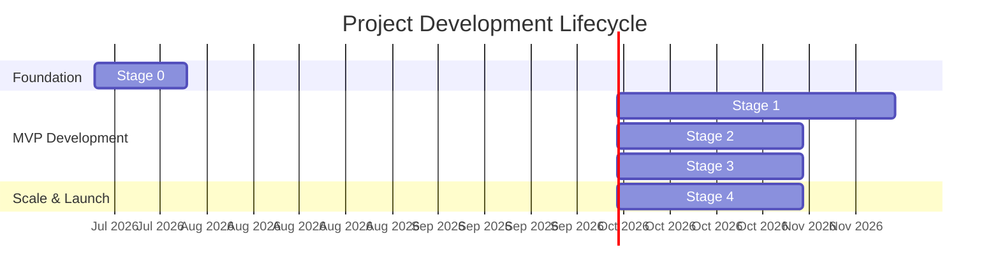

# Project Development Lifecycle — Safron (formerly "Uzbekistan Digital Tourism Ecosystem" / "UzTour")

**Version:** 2.1 (Brand, SEO & Launch Prep)
**Date:** 2026-08-09
**Status:** Active
**Purpose:** Track staged project development from inception to full production launch, prioritizing a premium UI and foundational backend architecture.

---

## Table of Contents

1. [Lifecycle Overview](#1-lifecycle-overview)
2. [Stage 0 — Infrastructure & Setup](#2-stage-0--infrastructure--setup)
3. [Stage 1 — Premium Visual Identity & Core Architecture](#3-stage-1--premium-visual-identity--core-architecture)
4. [Stage 2 — Core Business Workflows & Transactions](#4-stage-2--core-business-workflows--transactions)
5. [Stage 3 — Advanced Ecosystem Features](#5-stage-3--advanced-ecosystem-features)
6. [Stage 4 — Compliance, Scale & Launch](#6-stage-4--compliance-scale--launch)
7. [Progress Tracking Dashboard](#7-progress-tracking-dashboard)

---

## 1. Lifecycle Overview

### Strategic Shift: UI-First & "Visit Saudi" Aesthetic

To establish immediate trust and deliver a world-class experience, the project has shifted to a **UI-First** methodology for Stage 1. 
Instead of building features vertically (frontend + backend simultaneously), we will build the entire platform visually, mapping out every user journey in high-fidelity with real database connections and massive seed data.

* **Design Standard:** The aesthetic target is the **Visit Saudi** official portal (premium layouts, smooth micro-animations, minimalist informational density).
* **Real Foundations:** No mock APIs. The UI will be powered by real Supabase routing and database schemas, populated entirely by comprehensive seed scripts.
* **Context-Dependent Responsiveness:**
  * **Mobile-First:** *Tourist Landing Page* & *Supplier (Provider) App*. Essential for on-the-go tourists and field workers. These must feel like native mobile apps while scaling perfectly to desktop.
  * **Desktop-First:** *Admin Portal* & *Agency Portal*. Designed for power-users managing bulk actions, high-density data visualizations, and complex dashboards on workstations.

### Stage Map

---

## 2. Stage 0 — Infrastructure & Setup

> **Duration:** 2 weeks  
> **Goal:** Establish the technical foundation so all team members can develop features in parallel.

### Deliverables Checklist
- [x] **Monorepo initialized** with Turborepo + pnpm workspaces (Tourist, Provider, Agency, Admin).
- [x] **Shared packages** created (UI, Database, Auth, Types, Config).
- [x] **Database schema deployed** (Core tables: users, profiles, services, bookings).
- [x] **CI/CD pipeline operational** (Vercel preview deploys).
- [x] **Design tokens defined** (Tailwind config matching new premium aesthetic).

---

## 3. Stage 1 — Premium Visual Identity & Core Architecture

> **Duration:** 6 weeks  
> **Goal:** Deliver the complete visual workflow for all four portals, connected to real database schemas with comprehensive seed data. All routing and data fetching must work, while deep business logic is deferred.

### Sequence of Execution
We will build the portals in the following order to ensure a logical flow of UI data:
1. Tourist Landing Page & Discovery
2. Admin Dashboard & Oversight
3. Agency Portal (B2B)
4. Supplier / Provider App (B2B/C)

### 3.1 Tourist WebApp (Landing & Discovery)
**Strategy:** Mobile-First, App-like feel.
- [x] **Visit Saudi Aesthetic:** Implement immersive landing page with full-bleed imagery, smooth scroll animations (Framer Motion), and sophisticated typography.
- [x] **Routing & Navigation:** Seamless transition between Home, Discover, Map, and Profile pages.
- [x] **Real Data Integration:** Fetch locations, travel packages, and categories directly from Supabase (using seeded data).
- [x] **Workflow States Built:**
  - Login / Registration modals.
  - "Discover Uzbekistan" destination carousels.
  - Service detail views (stubbed booking buttons).

### 3.2 Admin Portal
**Strategy:** Desktop-First, High-Density.
- [ ] **Dashboard Layout:** Sidebar navigation, complex data tables, and KPI metric cards.
- [x] **Workflow States Built:**
  - **Verification Hub:** UI showing pending agency/supplier registration requests. Detailed view of uploaded documents and Approve/Reject controls.
  - **Oversight:** Empty state for the heatmap and analytics graphs.
- [ ] **Real Data Integration:** Fetch list of users, providers, and agencies from the real database. It shoudl cashe it so it would not send new requests every time it reloads.

### 3.3 Agency Portal
**Strategy:** Desktop-First, Power-User focused.
- [ ] **Workflow States Built:**
  - Agency Registration flow (including "Awaiting Admin Approval" holding screen).
  - Inventory Dashboard: Grid/List views of available suppliers and packages.
  - Itinerary Canvas: Layout for the drag-and-drop calendar (UI only, logic deferred).
- [ ] **Real Data Integration:** Load approved suppliers and services from Supabase.

### 3.4 Supplier (Provider) App
**Strategy:** Mobile-First, Accessible & Simple.
- [ ] **Workflow States Built:**
  - Supplier Registration flow (including "Awaiting Admin Approval" holding screen).
  - Main Dashboard: Giant Availability Toggle (UI state changes color/animation).
  - Service Creation Form: Upload photos, description, and price (saves to DB).
  - "My Bookings" list view.
- [ ] **Real Data Integration:** Profile fetching, saving new services to the Supabase `services` table.

### 3.5 [NEW] The Identity & Verification Bridge
**Goal:** Connect Auth states to the Admin Hub to remove the "placeholder" feel.
- [x] **State-Aware Middleware:** Implement routing logic that checks `user.is_verified` before allowing access to B2B dashboards.
- [x] **B2B Onboarding UI:** Build the high-fidelity registration forms for Agencies (License upload) and Providers (Service type selection).
- [x] **The "Holding" Experience:** Create the premium `/auth/pending` page that users see while waiting for Aziz (Admin) to approve them.
- [ ] **Real-Time Verification:** Ensure the "Approve" button in the Admin Portal updates the `users.is_verified` boolean in Supabase, instantly granting the user access via a Realtime subscription.

### 3.6 Stage 1 Backend Foundations
- [x] **Comprehensive Seed Strategy:** Develop `seed.sql` and node scripts that populate the database with realistic, high-quality data (matching the "Visit Saudi" aesthetic requirements: high-res image URLs, real destination descriptions, dummy user accounts for every role).
- [x] **Real Connections:** No mock APIs. Use Supabase client for all data fetching.

### 3.7 Core Authentication & Approvals
- [x] **Authentication Flow:** Connected Supabase Auth, enforced JWT routing protection and role-based redirects.
- [x] **Approval Workflows:** Connected the Admin Portal's Approve/Reject buttons to update user roles/statuses in the database, triggering access for Agencies/Suppliers.
- [x] **Email confirmation disabled** for new tourist registrations (temporary, by explicit request — users can create an account without verifying email).

### 3.8 [NEW] Tourist WebApp — Mobile/Desktop Responsive Audit (2026-08-08 follow-up)
A teammate's mobile-responsiveness pass left several already-"complete" Stage 1 pages with real regressions —
mobile looked right, desktop/laptop was broken. Found and fixed via direct reproduction (Playwright, not
guesswork) rather than closed as assumed-fine:
- [x] **Destinations, Packages, Experiences, Events pages:** a single mobile-sized `minmax(160px)` grid had no
  desktop breakpoint, so laptop/desktop users saw 6–8 phone-sized columns. Restored each page's original desktop
  card size behind a `min-width: 1024px` media query; mobile layout left untouched and verified unchanged.
- [x] **Offers section** converted to a real Swiper carousel (was previously a static, non-sliding grid).
- [x] **Destination cards:** fixed inconsistent card heights (`clamp()` height + 2-line title clamp).
- [x] **Footer** redesigned as an accordion (visitsaudi.com reference); **BottomNav** active-tab indicator resized
  (was "popping out" over adjacent tabs).
- [x] **Duplicate Footer/BottomNav instances** found and removed across multiple pages.
- [x] **Fixed a hard app-wide crash:** `BottomNav.tsx` violated React's Rules of Hooks (conditionally skipped
  `useEffect` on `/auth/*` routes). Since the component stays mounted across client-side navigation and the app
  has no `error.tsx` boundary anywhere, any nav away from an auth page — e.g. tapping "Back to Home" during
  signup — crashed the *entire* app to a blank "Application error" screen. Reproduced end-to-end with a real
  signup flow before and after the fix; confirmed resolved.
- [x] **`InstallPrompt`** was showing on desktop/laptop (`beforeinstallprompt` fires there too); now `md:hidden`,
  mobile-only as intended.
- [x] **PWA standalone/installed mode** (iOS home-screen, Android PWA) now hides the marketing footer
  automatically, matching native-app expectations.

### 3.9 [NEW] Public Marketing Landing Pages — Provider App & Agency Portal
Not in the original Stage 1 scope — both apps' public `/` route was still the bare scaffold placeholder.
- [x] Built full conversion-focused landing pages for both: Hero, Problem, Features (grounded in real shipped
  functionality, not aspirational copy), How It Works, Roadmap ("what's next," clearly labeled unbuilt), Vision/
  live stats, Final CTA, Footer.
- [x] Rebuilt tourist-webapp's `/about` page — replaced generic B2B/investor-deck content (a "4 internal
  portals" grid that had no business being shown to a traveler) with a traveler-facing story and a "What We
  Stand For" section grounded in real product behavior (verification, direct booking, no middlemen).

---

## 4. Stage 2 — Core Business Workflows & Transactions

> **Duration:** 4 weeks  
> **Goal:** Wire up the heavy functional logic behind the beautiful interfaces created in Stage 1.
> **Verified:** 2026-08-01, full code-level audit against this checklist (booking/review flows traced end-to-end, all 4 apps checked for hardcoded/mock data).

### Deliverables Checklist
- [x] **Tourist WebApp Integration:** Display real listings and offerings directly from providers and agencies. Confirmed live Supabase-backed across landing, discovery, and profile pages.
- [x] **Review & Rating System:**
  - Tourists can leave a post-booking review (comment, star rating). `POST /api/v1/reviews` now also enforces server-side that the associated booking is `completed` before accepting a review (previously client-side only).
- [x] **Offerings & Inventory Management:**
  - **Providers:** Real create/update/delete against `services`, including photo upload to Supabase Storage.
  - **Agencies:** Real create/update/delete against `itineraries`/`itinerary_items` via a form-based Packages page.
- [x] **Comprehensive Booking Flow (Real-time):**
  - Provider/Agency booking detail views, Accept/Decline, and full `booking_status_history` audit trail — all real DB writes.
  - Supabase Realtime confirmed wired on both sides (tourist gets notified on accept/decline; provider/agency gets notified on new bookings).
- [x] **Review Management:** Providers and Agencies fetch real reviews (`getReviewsForServices`/`getReviewsForItineraries`) and replies persist via `updateReviewResponse`.
- [x] ~~**Agency CRM:** Make the Kanban board fully functional~~ — **Descoped 2026-08-01.** No drag-and-drop Kanban was built; Accept/Decline buttons on a sortable data table cover the same status-transition functionality with real DB persistence. Revisit as a UX upgrade only if a future audit shows the button-driven flow is a workflow bottleneck.
- [x] ~~**Itinerary Canvas** (drag-and-drop calendar, mentioned in Stage 1 §3.3)~~ — **Descoped 2026-08-01.** Replaced by the simpler form-based Packages CRUD page above; itinerary/itinerary_items persistence is real, just not drag-and-drop.

### Admin Portal follow-up (found during the 2026-08-01 audit, now fixed)
Stage 1's "UI-first" build left several Admin Portal surfaces with hardcoded placeholder numbers
that were never wired to real queries. All fixed as part of Stage 2 close-out:
- Dashboard KPIs (active tourists, pending verifications, total bookings, GMV) and the revenue
  chart now use real Supabase aggregate queries (`apps/admin-portal/src/app/actions/dashboardActions.ts`).
- Analytics page (previously a one-line placeholder) now shows real bookings-by-status,
  users-by-role, top services, and review-quality breakdowns.
- Users page (previously a static "Stage 2" stub) now lists real accounts with role/status filtering.
- Verification Hub's secondary KPI cards (Active Tourists, GMV, Verified Providers) were hardcoded;
  now real. Its "Live Tourist Density" panel was falsely labeled "LIVE" for a decorative
  placeholder — relabeled "PREVIEW" pending the actual Mapbox/PostGIS integration (Stage 3).
- Verification queue was silently rendering "No ID · No License" for every request —
  `company_registration_number`/`license_number` were displayed but never collected by the
  registration flow or present in the schema. Now shows real submitted data (email/phone/role) instead.
- Agency Dashboard's "Pending Bookings" stat was hardcoded to `0`; its "Active Listings" stat was
  also silently always-zero (queried the `services` table, which agencies never own rows in —
  should have queried `itineraries`). Both now query real, correct data.

---

## 5. Stage 3 — Advanced Ecosystem Features

> **Duration:** 4 weeks  
> **Goal:** Integrate the "Wow Factor" features and AI capabilities.

### Deliverables Checklist
- [ ] **Taste & Trust Scanner:** Connect the camera UI to OpenAI Vision API for real-time menu translation and allergen detection.
- [ ] **Contextual Translator:** Connect the chat UI to LLM endpoints for cultural translations.
- [ ] **Itinerary Builder:** Implement the complex auto-pricing and scheduling logic for the Agency drag-and-drop calendar.
- [ ] **Survival Map:** Connect Mapbox GL to PostGIS geospatial queries for live SOS/Cultural pins.

---

## 6. Stage 4 — Compliance, Scale & Launch

> **Duration:** 4 weeks  
> **Goal:** Prepare the platform for government partnership, harden security, and public release.

### Deliverables Checklist
- [ ] **E-Mehmon Automation:** OCR passport scanning (UI already built in Stage 1) connected to data extraction and Excel/CSV export logic.
- [ ] **Payments:** Stripe and Payme/Click integration for actual transaction processing.
- [ ] **Dynamic Crowd-Shifting API:** Background jobs to calculate tourist density and adjust recommended alternatives.
- [ ] **Launch Readiness:** 
  - Lighthouse audits (Score > 90 across performance/accessibility).
  - Cloudflare WAF and SSL configuration.
  - Final Marketing deployment.

### 6.1 [NEW] Brand, SEO & Production Deployment (started 2026-08-08)
Not part of the original Stage 4 scope (which is about deep business/compliance features), but this is the
actual launch-track work underway right now, tracked separately so it isn't confused with E-Mehmon/Payments below.
- [x] **Rebrand:** entire product renamed from "UzTour" / "Silk Road Uzbekistan" to **Safron** across all 4 apps —
  navbars, dashboard sidebars, footers, PWA manifests, page metadata. Historical "Silk Road" content deliberately
  *kept* where it's thematic marketing copy (e.g. hero lines, package names) rather than brand identity.
- [x] **SEO:** full metadata (title templates, Open Graph, Twitter cards, robots, canonical URLs) added to all 4
  apps; admin-portal explicitly set `noindex` as an internal-only tool.
- [x] **Favicons:** rebuilt as static SVGs after discovering `next/og`'s dynamic image generation is broken in
  this dev environment (a Windows path-with-space bug inside `@vercel/og`, confirmed via failed local builds).
- [ ] **Social preview (OG) image** — blocked by the same environment bug; needs to be designed externally as a
  static asset and wired into `openGraph.images`.
- [x] **Vercel deployment (in progress):** all 4 apps set up as separate Vercel Projects from one repo. Fixed 3
  real deploy-blocking bugs found via actual failed build logs, not hypothetical review:
  1. Missing Supabase env vars in Vercel project settings (tourist-webapp).
  2. Turborepo's `strict` env mode silently stripping `SUPABASE_SERVICE_ROLE_KEY` before it reached `next build`
     even though it *was* set correctly in Vercel — fixed via a `globalEnv` declaration in the root `turbo.json`.
  3. A phantom `framer-motion` dependency in provider-app and agency-portal (used throughout the new landing
     pages but never added to either `package.json`) — worked locally via pnpm hoisting, failed on Vercel's
     isolated install. Fixed in both `package.json` files plus `pnpm-lock.yaml`.
- [ ] **Domain & DNS:** `safron.uz` + subdomain scheme (`admin.` / `agencies.` / `providers.`) — guide written,
  not yet executed against the real registrar.
- [ ] **Supabase redirect-URL allowlist** update for the production domains — documented as required (auth
  breaks in prod otherwise), not yet confirmed applied.
- [ ] **Final smoke test** across all 4 live production domains once fully deployed.

---

## 7. Progress Tracking Dashboard

| Stage | Status | Progress | Focus |
|---|---|---|---|
| Stage 0: Setup | 🟢 Complete | 100% | Infrastructure |
| Stage 1: Premium UI & Core DB | 🟡 In Progress | 85% | Core UI/DB/Auth complete; 2026-08-08 follow-up fixed a real app-crashing bug + several desktop regressions on already-"complete" pages, and added the provider/agency marketing landing pages + a rebuilt About page (not in original scope). Admin caching and Agency/Provider "Real Data Integration" checkboxes still unverified this session — not re-audited. |
| Stage 2: Business Workflows | 🟢 Complete | 100% | Offerings, real-time bookings, and reviews verified end-to-end 2026-08-01; Kanban/Itinerary Canvas formally descoped in favor of the simpler CRUD UI already shipped |
| Stage 3: Advanced Features | ⬜ Not Started | 0% | AI Scanners, Itineraries — untouched this session |
| Stage 4: Compliance & Launch | 🟡 In Progress | ~15% | Original scope (E-Mehmon, Payments, Dynamic Pricing) still 0%. Separately: rebrand to Safron, full SEO, and Vercel deployment are actively underway (§6.1) — 3 real deploy-blocking bugs found and fixed via actual failed builds; domain/DNS and Supabase redirect config still pending. |

### How to Update
Update this document at the end of each sprint. Mark completed items with `[x]` and adjust the progress percentages in the table.

**Note on scope (2026-08-09):** items marked `[NEW]` throughout this document were not part of the original
plan — they're real work completed that didn't have a home in the existing structure. This lifecycle doc tracks
*implementation* (features, bug fixes, infra); external communication artifacts produced alongside this work
(a trilingual project-overview one-pager, a pitch-deck PDF) are intentionally not listed here since they aren't
implementation deliverables.
